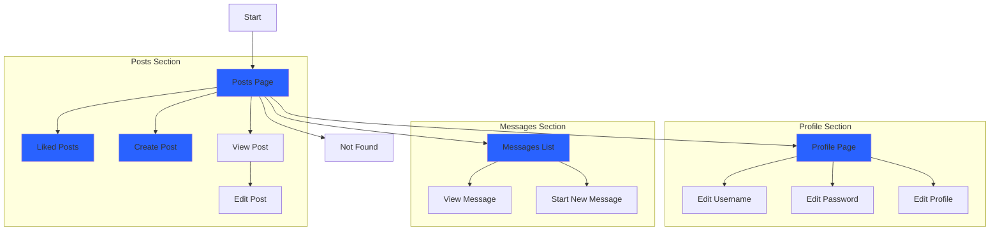
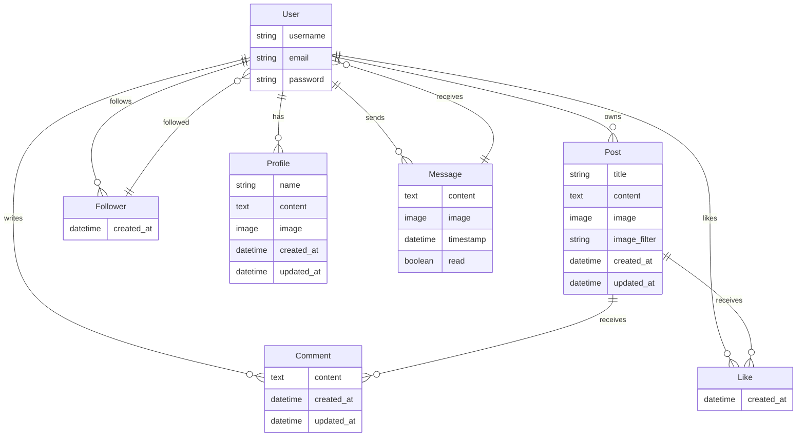

# 1. PROJECT 5: React Frontend

# 2. Features

# 3. User Experience 

## 3.1. User stories

| Category  | as      | I want to                      | so that I can                                                                                    | UI components                                |
| --------- | ------- | ------------------------------ | ------------------------------------------------------------------------------------------------ | -------------------------------------------- |
| auth      | user    | register for an account        | have a personal profile with a picture                                                           | SignUpForm ProfilePage ProfileEditForm |
| auth      | user    | register for an account        | create, like and comment on posts                                                                | Post PostPage Comment                  |
| auth      | user    | register for an account        | follow users                                                                                     | Profile ProfilePage                       |
| posts     | visitor | view a list of posts           | browse the most recent uploads                                                                   | PostsPage                                    |
| posts     | visitor | view an individual post        | see user feedback, i.e. likes and read comments                                                  | Post PostPaget                            |
| posts     | visitor | search a list of posts         | find a post by a specific artist or a title                                                      | PostsPage                                    |
| posts     | visitor | scroll through a list of posts | browse the site more comfortably                                                                 | InfiniteScrollComponent                      |
| posts     | user    | edit and delete my post        | correct or hide any mistakes                                                                     | PostEditForm MoreDropdownMenu             |
| posts     | user    | create a post                  | share my moments with others                                                                     | PostCreateForm                               |
| posts     | user    | view liked posts               | go back often to my favourite posts                                                              | PostsPage                                    |
| posts     | user    | view followed users' posts     | keep up with my favourite users' moments                                                         | PostsPage                                    |
| likes     | user    | like a post                    | express my interest in someone's shared moment                                                   | Post like icon                               |
| likes     | user    | unlike a post                  | express that my interest in someone's shared moment has faded away                               | Post (un) like icon                          |
| comments  | user    | create a comment               | share my thoughts on other people's content                                                      | PostPage CommentCreateForm                |
| comments  | user    | edit and delete my comment     | correct or hide any mistakes                                                                     | PostPage Comment MoreDropdownMenu      |
| profiles  | user    | view a profile                 | see a user's recent posts + post, followers, following count data                                | ProfilePage Post                          |
| profiles  | user    | edit a profile                 | update my profile information                                                                    | ProfileEditForm                              |
| followers | user    | follow a profile               | express my interest in someone's content                                                         | Profile follow button                        |
| followers | user    | unfollow a profile             | express that my interest in someone's content has faded away and remove their posts from my feed | Profile (un) follow button                   |

## 3.2. Structure of the application

Website Navigation for signed in user (Blue indicates a Navbar option)

API Model Diagram:

### 3.2.1. Most reused components:

- PostsPage:
  - Home, Feed, Liked
- Post:
  - PostsPage
- Profile:
  - PopularProfiles, PopularProfiles (mobile)
- DropdownMenus:
  - Post, ProfilePage, Comment
- InfiniteScrollComponent:
  - PostPage (loading Comment components)
  - PostsPage (loading all, feed or liked Post components)
  - ProfilePage (loading Post components that belong to the profile)

# Agile Development

Very important for this project was to develop a succesful agile development process. In particular Epics, sprints, user stories and acceptance criteria were used to manage the development process.

# 4. Deployment steps

- add prebuild script
- add Procfile
- remove all console.logs
- use Bootstrap default imports to minimize the build
- deploy to Heroku

## 4.1. Testing in development:

It is recommended to test the application with gitpod, as it is the environment where the application was developed. The following steps are required to run the application in development:

React Frontend Repo:
1. Open the terminal
2. Run `npm install` to install all dependencies
3. before using `npm start` to start the development server, use `nvm install 16` to install the correct node version, followed by `nvm use 16` to switch to it.
4. Run `npm start` to start the development server

API Backend Repo:
1. Open the terminal
2. Run `pip install -r requirements.txt` to install all dependencies
3. Run `python manage.py runserver` to start the development server

# 5. Tests:

## 5.1. Automated:

- used the msw library to mock user and logout endpoints
- tested the NavBar component:
  - renders without a problem
  - renders the link to a user profile for a logged in user
  - renders the sign in and sign up buttons again on logout

## 5.2. Manual:

- every other feature tested extensively

## 5.3. Libraries, contexts and hooks:

- react-infinite-scroll-component
  - introduced to replace traditional pagination with lazy loading instead of pagination to make the application more performant and seem more snappy/ engaging
- react-bootstrap:
  - introduced
- contexts:
  - CurrentUserContext exposes the user state to the entire app. Relevant components can subscribe to its changes
  - ProfileDataContext exposes the profile state to the entire app. Enables the PopularProfiles component to be in sync with the ProfilePage contents
- custom hooks written to reduce repeatable state logic:
  - useClickOutsideToggle: enable toggle on the burger menu
  - useRedirect: enable redirect for users who are either logged in or logged out, depending on the use case

# 6. Credits and acknowledgements

- "Moments" was used as a boilerplate for the project as it contained the necessary features for a social media platform. Both the API and the React frontend were built from this code.
  - Frontend:
  - API: Repo and Live Demo Links$$$$$$$$$$$$$$$$$$$$$
