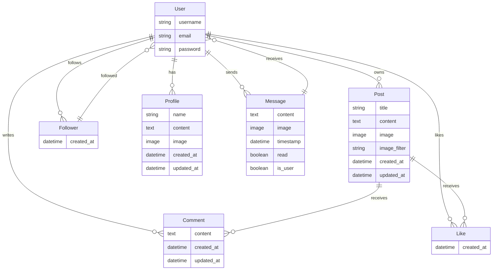

# API Readme

This Readme focuses on the API for the social media platform. The API is built using Django Rest Framework.

Anything already mentioned in the documentation of Frontend Repository, such as Agile Methodology, is omitted here for brevity.

# Models Structure 

API Model Diagram:

# API endpoints, Manual Testing with Postman 

Below summarises the API endpoints for the social media platform.

| HTTP Method | URL   | Notes    | View type (List, Detail, NA) | POST/PUT input    | Output  | 
| ---- | --------------------- | ---------------- | ------------------ | --------------------------------------------------- | ------------------ |
| POST        | dj-rest-auth/login/            |                                               | List                         | { "username": "postmanuser", "password": "password" }                                                           | { "access_token": "eyJ0eXAiOiJKV1QiL...", /\*omitted] "refresh_token": "eyJ0eXAiOiJKV1QiL...", /\*omitted "user": { "pk": 25, "username": "postmanuser", "email": "", "first_name": "", "last_name": "", "profile_id": 24, "profile_image": "https://res.cloudinary.com/dh5lpihx1/image/upload/v1/media/images/default_profile_dqcubz.jpg" } }          |
| GET         | /users/                        | Retrieve user list                            | List                         |      | { "count": 10, "next": null, "previous": null, "results": [ { "id": 28, "username": "testuser7" }, { "id": 21, "username": "testuser23" }, { "id": 24, "username": "posttmanusr" }, ... ] }                    |
| GET         | /users/{id}/                   | Retrieve user details                         | Detail                       |      | { "id": 29, "username": "user" }                                                                                                                |
|             | MESSAGES APP                   |
| GET         | /messages/                     | Retrieve message list                         | List                         |      | [ { "id": 29, "username": "user", "recipient_profile_image": "https://res.cloudinary.com/dh5lpihx1/image/upload/v1/media/images/default_profile_dqcubz.jpg", "last_message": "hi there", "last_message_time": "11:52" }, { "id": 24, "username": "posttmanusr", "recipient_profile_image": "https://res.cloudinary.com/dh5lpihx1/image/upload/v1/media/images/default_profile_dqcubz.jpg", "last_message": "Hi there! This is POST requesting with Postman on ...", "last_message_time": "21 Aug" }, { "id": 22, "username": "user3", "recipient_profile_image": "https://res.cloudinary.com/dh5lpihx1/image/upload/v1/media/images/default_profile_dqcubz.jpg", "last_message": "yo!", "last_message_time": "21 Aug" } ]                                                                            |
| GET         | /messages/{id}/                | Retrieve message details                      | Detail                       |      | { "count": 7, "next": null, "previous": null, "results": [ { "id": 117, "sender": 25, "recipient": 29, "content": "Hi Test with upload image in API prod", "image": "https://res.cloudinary.com/dh5lpihx1/image/upload/v1724751086/brdqibwyd1phcukqn6gq.jpg", "date": "27 Aug 2024", "time": "09:31", "read": false, "sender_profile_image": "https://res.cloudinary.com/dh5lpihx1/image/upload/v1/media/images/default_profile_dqcubz.jpg", "recipient_profile_image": "https://res.cloudinary.com/dh5lpihx1/image/upload/v1/media/images/default_profile_dqcubz.jpg", "is_sender": true, "last_message": "hi there", "last_message_time": "11:52" }, ... ] }                   |
| POST        | /messages/{id}/send/           | Send a new message                            | Detail                       | { "content": "Hi there! This is POST requesting with Postman on production" }                                      | { "id": 133, "sender": 25, "recipient": 29, "content": "Hi there! This is POST requesting with Postman on production", "image": null, "date": "28 Aug 2024", "time": "11:39", "read": false, "sender_profile_image": "https://res.cloudinary.com/dh5lpihx1/image/upload/v1/media/images/default_profile_dqcubz.jpg", "recipient_profile_image": "https://res.cloudinary.com/dh5lpihx1/image/upload/v1/media/images/default_profile_dqcubz.jpg", "is_sender": true, "last_message": "Hi there! This is POST requesting with Postman on ...", "last_message_time": "11:39" }           |
| POST        | /messages/{id}/send/           | Send a message with an image                  | Detail                       | "{ "content": "Hi there" "image": "image.png" }"                                                                | { "id": 134, "sender": 25, "recipient": 29, "content": "hi there", "image": "https://res.cloudinary.com/dh5lpihx1/image/upload/v1724845255/haxht48ba5gcerdlgucn.png", "date": "28 Aug 2024", "time": "11:40", "read": false, "sender_profile_image": "https://res.cloudinary.com/dh5lpihx1/image/upload/v1/media/images/default_profile_dqcubz.jpg", "recipient_profile_image": "https://res.cloudinary.com/dh5lpihx1/image/upload/v1/media/images/default_profile_dqcubz.jpg", "is_sender": true, "last_message": "hi there", "last_message_time": "11:40" }                        |
| POST        | /messages/{recipient_id}/send/ | Start a new conversation                      | Detail                       | { "content": "hello user5!" }                                                                                      | { "id": 133, "sender": 25, "recipient": 29, "content": "hello user5!", "image": null, "date": "28 Aug 2024", "time": "11:39", "read": false, "sender_profile_image": "https://res.cloudinary.com/dh5lpihx1/image/upload/v1/media/images/default_profile_dqcubz.jpg", "recipient_profile_image": "https://res.cloudinary.com/dh5lpihx1/image/upload/v1/media/images/default_profile_dqcubz.jpg", "is_sender": true, "last_message": "hello user5!", "last_message_time": "11:39" }                                                                                                    |
| DELETE      | /messages/{id}/delete/         | Delete a specific message                     |                              | "{ "content": "Hi there" "image": "image.png" }"                                                                | { "id": 134, "sender": 25, "recipient": 29, "content": "hi there", "image": "https://res.cloudinary.com/dh5lpihx1/image/upload/v1724845255/haxht48ba5gcerdlgucn.png", "date": "28 Aug 2024", "time": "11:40", "read": false, "sender_profile_image": "https://res.cloudinary.com/dh5lpihx1/image/upload/v1/media/images/default_profile_dqcubz.jpg", "recipient_profile_image": "https://res.cloudinary.com/dh5lpihx1/image/upload/v1/media/images/default_profile_dqcubz.jpg", "is_sender": true, "last_message": "hi there", "last_message_time": "11:40" }                        |
| PATCH       | /messages/{id}/update/         | Update a specific message                     | Detail                       | "{ ""content"": ""hello user5!"" }"                                                                                | { "id": 117, "sender": 25, "recipient": 29, "content": "hello user5!", "image": "https://res.cloudinary.com/dh5lpihx1/image/upload/v1724751086/brdqibwyd1phcukqn6gq.jpg", "date": "27 Aug 2024", "time": "09:31", "read": false, "sender_profile_image": "https://res.cloudinary.com/dh5lpihx1/image/upload/v1/media/images/default_profile_dqcubz.jpg", "recipient_profile_image": "https://res.cloudinary.com/dh5lpihx1/image/upload/v1/media/images/default_profile_dqcubz.jpg", "is_sender": true, "last_message": "hi there", "last_message_time": "11:40" }                    |
| DELETE      | /messages/{id}/delete/         | Delete an entire chat                         |                              |      |                                      |
|             | POSTS APP                      |
| POST        | /posts/                        | Create a new post (with or without image)     | Detail                       | { "title": "My Test Post (Postman API)" "content": "This is a test post content" "image": "test_image.png" } | { "id": 48, "owner": "postmanuser", "is_owner": true, "profile_id": 24, "profile_image": "https://res.cloudinary.com/dh5lpihx1/image/upload/v1/media/images/default_profile_dqcubz.jpg", "created_at": "27 Aug 2024", "updated_at": "27 Aug 2024", "title": "My Test Post (Postman API)", "content": "This is a test post content", "image": "https://res.cloudinary.com/dh5lpihx1/image/upload/v1/media/images/test_image_whk6ly", "image_filter": "normal", "like_id": null }                                                                                                         |
| GET         | /posts/                        | Get Posts List                                | List                         |      | { "count": 8, "next": null, "previous": null, "results": [ { "id": 48, "owner": "postmanuser", "is_owner": true, "profile_id": 24, "profile_image": "https://res.cloudinary.com/dh5lpihx1/image/upload/v1/media/images/default_profile_dqcubz.jpg", "created_at": "27 Aug 2024", "updated_at": "27 Aug 2024", "title": "My Test Post (Postman API)", "content": "This is a test post content", "image": "https://res.cloudinary.com/dh5lpihx1/image/upload/v1/media/images/test_image_whk6ly", "image_filter": "normal", "like_id": null, "likes_count": 0, "comments_count": 0 }, { "id": 47, "owner": "postmanuser", "is_owner": true, "profile_id": 24, "profile_image": "https://res.cloudinary.com/dh5lpihx1/image/upload/v1/media/images/default_profile_dqcubz.jpg", "created_at": "27 Aug 2024", "updated_at": "27 Aug 2024", "title": "My Test Post (Postman API)", "content": "This is a test post content", "image": "https://res.cloudinary.com/dh5lpihx1/image/upload/v1/media/images/test_image_aukhfj", "image_filter": "normal", "like_id": null, "likes_count": 0, "comments_count": 0 }, ... |
| GET         | /posts/{id}/                   | Retrieve a specific post                      | Detail                       |      | { "id": 47, "owner": "postmanuser", "is_owner": true, "profile_id": 24, "profile_image": "https://res.cloudinary.com/dh5lpihx1/image/upload/v1/media/images/default_profile_dqcubz.jpg", "created_at": "27 Aug 2024", "updated_at": "27 Aug 2024", "title": "My Test Post (Postman API)", "content": "This is a test post content", "image": "https://res.cloudinary.com/dh5lpihx1/image/upload/v1/media/images/test_image_aukhfj", "image_filter": "normal", "like_id": null, "likes_count": 0, "comments_count": 0 }                                                            |
| PUT         | /posts/{id}/                   | Update a post (title, content, image, or all) | Detail                       | { "title": "My Test Post (Postman API)" "content": "This is a test post content" "image": "test_image.png" } | { "id": 48, "owner": "postmanuser", "is_owner": true, "profile_id": 24, "profile_image": "https://res.cloudinary.com/dh5lpihx1/image/upload/v1/media/images/default_profile_dqcubz.jpg", "created_at": "27 Aug 2024", "updated_at": "28 Aug 2024", "title": "My Test Post (Postman API)", "content": "This is a test post content", "image": "https://res.cloudinary.com/dh5lpihx1/image/upload/v1/media/images/test_image_z1iqf3", "image_filter": "normal", "like_id": null, "likes_count": 0, "comments_count": 0 }                                                            |
| DELETE      | /posts/{id}/                   | Delete a specific post                        |                              |      |

## Models App Overview

This Django-based messaging app provides a robust backend for a real-time chat application. It includes features such as sending messages, managing conversations, and handling user profiles.

### Models

The core model of the application is `Message`, which includes the following fields:

| Field | Type | Description |
|-------|------|-------------|
| `sender` | ForeignKey | User who sent the message |
| `recipient` | ForeignKey | User who received the message |
| `content` | TextField | Content of the message |
| `image` | CloudinaryField | Optional image attachment |
| `timestamp` | DateTimeField | Time when the message was sent |
| `read` | BooleanField | Indicates if the message has been read |

### Views

1. **MessageListView**: Displays a list of users the current user has had conversations with, along with the last message and timestamp.

2. **MessageDetailView**: Shows the thread of messages between two users.

3. **MessageDetailSendView**: Allows sending a new message in an existing conversation.

4. **MessageListStartNewView**: Initiates a new conversation with a user.

5. **MessageDeleteView**: Deletes a specific message.

6. **ChatDeleteView**: Deletes an entire conversation between two users.

7. **MessageUpdateView**: Allows editing of a sent message.

### Serializers

The `MessageSerializer` handles the serialization of Message objects, including:
- Formatting date and time
- Retrieving sender and recipient profile images
- Determining if the current user is the sender
- Fetching and truncating the last message
- Validating image uploads

### URLs

The app uses the following URL patterns:

| Endpoint | Description |
|----------|-------------|
| `/messages/` | List all conversations |
| `/messages/<int:user_id>/` | View/send messages in a specific conversation |
| `/messages/<int:user_id>/send/` | Send a new message |
| `/messages/<int:user_id>/start/` | Start a new conversation |
| `/messages/<int:pk>/delete/` | Delete a specific message |
| `/messages/<int:pk>/update/` | Update a specific message |
| `/chats/<int:user_id>/delete/` | Delete an entire conversation |

### Tests

The app includes comprehensive test coverage:

1. **MessageWithImageTestCase**: Tests sending messages with images.
2. **MessageWithImageValidationTestCase**: Validates image uploads, including size and format restrictions.
3. **MessageListViewTest**: Tests the conversation list view.
4. **IsSenderFieldTests**: Ensures the `is_sender` field is correctly set.
5. **MessageSerializerTests**: Validates the message serializer functionality.
6. **ChatDeleteTest**: Tests the chat deletion feature.
7. **MessageSendTests**: Verifies message sending functionality.
8. **MessageDeleteTest**: Checks message deletion.
9. **MessageListStartNewViewTests**: Tests initiating new conversations.
10. **MessageUpdateTests**: Verifies message editing functionality.
11. **MessageModelTests**: Ensures correct timestamp behavior for messages.

### Key Features

- Real-time messaging
- Image support in messages
- User profile integration
- Conversation management (start, delete)
- Message operations (send, edit, delete)
- Comprehensive test coverage
- Cloudinary integration for image storage

# Apps Overview

This section provides an overview of the core components of our social media application, excluding the messaging functionality.

## Posts app

This app manages user posts, including creation, retrieval, updating, and deletion. It also handles post likes and comments.

Key features

- Create, view, update, and delete posts
- Filter posts by user, followed users, and liked posts

### Model
The `Post` model is defined in `posts/models.py`:

| Field | Type | Properties |
|-------|------|------------|
| owner | ForeignKey | User model |
| created_at | DateTimeField | auto_now_add=True |
| updated_at | DateTimeField | auto_now=True |
| title | CharField | max_length=255 |
| content | TextField | blank=True |
| image | ImageField | upload_to='images/', default='../default_post_rgq6aq', blank=True |

Ordering: ['-created_at']

### Views
Located in `posts/views.py`:

| View | Type | Description |
|------|------|-------------|
| PostList | ListCreateAPIView | List and create posts, custom ordering, filtering |
| PostDetail | RetrieveUpdateDestroyAPIView | Retrieve, update, delete individual posts |

Both views use `IsOwnerOrReadOnly` permission class.

### Serializer
`PostSerializer` in `posts/serializers.py`:

| Field | Type | Description |
|-------|------|-------------|
| id, owner, title, content, image | Model fields | Direct from Post model |
| is_owner | SerializerMethodField | Check if current user is post owner |
| profile_id, profile_image | ReadOnlyField | From user's profile |
| created_at, updated_at | ReadOnlyField | Timestamp fields |
| like_id | SerializerMethodField | ID of current user's like, if any |
| likes_count | SerializerMethodField | Total number of likes |
| comments_count | SerializerMethodField | Total number of comments |

Custom methods:
- `validate_image`: Validates image file size and dimensions
- `get_is_owner`, `get_like_id`, `get_likes_count`, `get_comments_count`: Compute respective fields

### Filters
Custom `PostFilter` in `posts/views.py`:

| Filter | Description |
|--------|-------------|
| owner | Posts by a specific user |
| followed | Posts from followed users |
| liked | Posts liked by the current user |

### URLs
Defined in `posts/urls.py`:

| Endpoint | Methods | Description |
|----------|---------|-------------|
| `posts/` | GET, POST | List and create posts |
| `posts/<int:pk>/` | GET, PUT, PATCH, DELETE | Retrieve, update, delete a specific post |

### Tests
Located in `posts/tests.py`:

| Test Class | Description | Key Tests |
|------------|-------------|-----------|
| PostListViewTests | Tests for post creation | - Create post when logged in - Cannot create post when logged out - Post title is required - Image size limits |
| PostDetailViewTests | Tests for post operations | - Retrieve post by id - Update own post - Cannot update others' posts - Delete own post - Cannot delete others' posts |
| PostListViewFilterTests | Tests for post filtering | - Filter by followed users - Filter when not following anyone - Filter liked posts - Filter by specific user |
| PostListViewOrderTests | Tests for post ordering | - Order by likes - Order by comments - Default order (created date) |

## Comments

key features:
- Create, view, update, and delete comments

| Aspect | Details |
|--------|---------|
| Model | `Comment` in `comments/models.py` Fields: owner (User), post (Post), created_at, updated_at, content |
| Views | `CommentList` (ListCreateAPIView) `CommentDetail` (RetrieveUpdateDestroyAPIView) |
| Serializer | `CommentSerializer` and `CommentDetailSerializer` in `comments/serializers.py` Custom fields: is_owner, formatted timestamps |
| Tests | Located in `comments/tests.py` Should cover: creation, retrieval, update, deletion |

## Likes app

Key features:
- Like posts
- View likes count for each post
- Unlike posts

| Aspect | Details |
|--------|---------|
| Model | `Like` in `likes/models.py` Fields: owner (User), post (Post), created_at Unique constraint: owner and post |
| Views | `LikeList` (ListCreateAPIView) `LikeDetail` (RetrieveDestroyAPIView) |
| Serializer | `LikeSerializer` in `likes/serializers.py` Handles unique constraint in create method |
| Tests | Located in `likes/tests.py` Should cover: creation, retrieval, deletion, duplicate attempts |

## Follows app

Key features
- Follow users
- View followers and following count
- Unfollow users

| Aspect | Details |
|--------|---------|
| Model | `Follower` in `followers/models.py` Fields: owner (User), followed (User), created_at Unique constraint: owner and followed |
| Views | `FollowerList` (ListCreateAPIView) `FollowerDetail` (RetrieveDestroyAPIView) |
| Serializer | `FollowerSerializer` in `followers/serializers.py` Handles unique constraint in create method |
| Tests | Located in `followers/tests.py` Should cover: creation, retrieval, deletion, duplicate attempts |

## Users app

This is the core app for user management, including registration, authentication, and profile management, it is mostly handled by Django's built-in User model.

| Aspect | Details |
|--------|---------|
| Model | Django's built-in User model |
| Views | `UserListView` (ListAPIView) `UserDetailView` (RetrieveAPIView) |
| Serializer | `UserSerializer` (assumed) |
| Tests | Not explicitly provided, but should be implemented |

## Profiles app

This is an extension of the User model, providing additional fields and functionality for user profiles.

Key features:
- Create, view, update, and delete profiles
- Retrieve profiles by user ID
- Upload profile images

| Aspect | Details |
|--------|---------|
| Model | `Profile` in `profiles/models.py` Fields: owner (OneToOneField to User), created_at, updated_at, name, content, image |
| Views | `ProfileList` (ListAPIView) `ProfileDetail` (RetrieveUpdateAPIView) |
| Serializer | `ProfileSerializer` in `profiles/serializers.py` |
| Tests | Located in `profiles/tests.py` |

### Model
The `Profile` model is defined in `profiles/models.py`:

| Field | Type | Properties |
|-------|------|------------|
| owner | OneToOneField | User model, on_delete=models.CASCADE |
| created_at | DateTimeField | auto_now_add=True |
| updated_at | DateTimeField | auto_now=True |
| name | CharField | max_length=255, blank=True |
| content | TextField | blank=True |
| image | ImageField | upload_to='images/', default='../default_profile_qdjgyp' |

### Views
Located in `profiles/views.py`:

| View | Type | Description |
|------|------|-------------|
| ProfileList | ListAPIView | List all profiles |
| ProfileDetail | RetrieveUpdateAPIView | Retrieve and update individual profiles |

`ProfileDetail` uses `IsOwnerOrReadOnly` permission class.

### Serializer
`ProfileSerializer` in `profiles/serializers.py`:

| Field | Type | Description |
|-------|------|-------------|
| owner | ReadOnlyField | Username of the profile owner |
| is_owner | SerializerMethodField | Check if current user is profile owner |
| following_id | SerializerMethodField | ID of follower object if user is following this profile |
| posts_count | ReadOnlyField | Number of posts by the profile owner |
| followers_count | ReadOnlyField | Number of followers for the profile |
| following_count | ReadOnlyField | Number of users the profile owner is following |

### Unit Tests
Located in `profiles/tests.py`:

| Test Class | Description | Key Tests |
|------------|-------------|-----------|
| ProfileListViewTests | Tests for profile list view | - Retrieve all profiles |
| ProfileDetailViewTests | Tests for profile detail view | - Retrieve profile by id - Update own profile - Cannot update other users' profiles |

These tests cover profile retrieval and update operations, ensuring that proper permissions are enforced.

### URLs
Defined in `profiles/urls.py`:

| Endpoint | Methods | Description |
|----------|---------|-------------|
| `profiles/` | GET | List all profiles |
| `profiles/<int:pk>/` | GET, PUT | Retrieve or update a specific profile |

