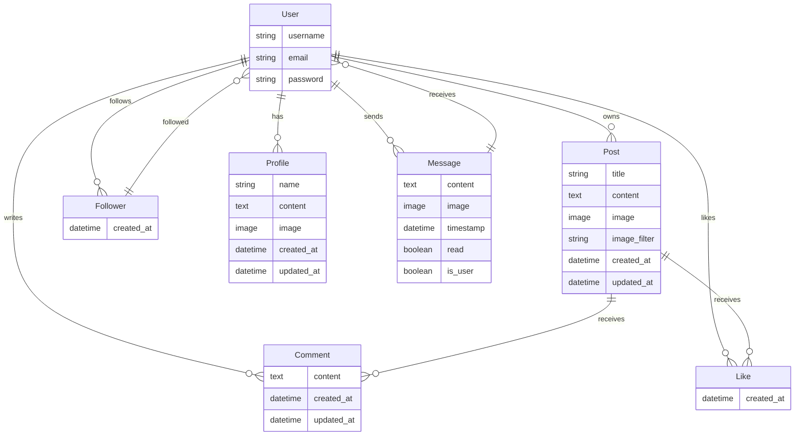

This repo focuses on the API for the social media platform. The API is built using Django Rest Framework.

Anything already mentioned in the documentation of Frontend Repository, such as Agile Methodology, is omitted here for brevity.

# Models Structure 

API Model Diagram:

# Views and URLS with API endpoints

Below summarises the API endpoints for the social media platform.

| HTTP Method | URL                            | Notes                                         | View type (List, Detail, NA) | POST/PUT input                                                                                                           | Output                                                                                                                                                                                                                                                                                                                                                                                                                                                                                                                                                                                                                                                                                                                                                                                                                                                                                                                                                                                                                                                                                                                                                                                                                        |
| ----------- | ------------------------------ | --------------------------------------------- | ---------------------------- | ------------------------------------------------------------------------------------------------------------------------ | ----------------------------------------------------------------------------------------------------------------------------------------------------------------------------------------------------------------------------------------------------------------------------------------------------------------------------------------------------------------------------------------------------------------------------------------------------------------------------------------------------------------------------------------------------------------------------------------------------------------------------------------------------------------------------------------------------------------------------------------------------------------------------------------------------------------------------------------------------------------------------------------------------------------------------------------------------------------------------------------------------------------------------------------------------------------------------------------------------------------------------------------------------------------------------------------------------------------------------- |
|             | AUTHENTICATION                 |
| POST        | dj-rest-auth/login/            |                                               | List                         | { "username": "postmanuser", "password": "password" }                                                           | { "access_token": "eyJ0eXAiOiJKV1QiL...", /\*omitted] "refresh_token": "eyJ0eXAiOiJKV1QiL...", /\*omitted "user": { "pk": 25, "username": "postmanuser", "email": "", "first_name": "", "last_name": "", "profile_id": 24, "profile_image": "https://res.cloudinary.com/dh5lpihx1/image/upload/v1/media/images/default_profile_dqcubz.jpg" } }                                                                                                                                                                                                                                                                                                                                                                                                                                                                                                                                                                                                                                                                                                                                                                                                                                            |
| GET         | /users/                        | Retrieve user list                            | List                         |                                                                                                                          | { "count": 10, "next": null, "previous": null, "results": [ { "id": 28, "username": "testuser7" }, { "id": 21, "username": "testuser23" }, { "id": 24, "username": "posttmanusr" }, ... ] }                                                                                                                                                                                                                                                                                                                                                                                                                                                                                                                                                                                                                                                                                                                                                                                                                                                                                                                                                                          |
| GET         | /users/{id}/                   | Retrieve user details                         | Detail                       |                                                                                                                          | { "id": 29, "username": "user" }                                                                                                                                                                                                                                                                                                                                                                                                                                                                                                                                                                                                                                                                                                                                                                                                                                                                                                                                                                                                                                                                                                                                                                                     |
|             | MESSAGES APP                   |
| GET         | /messages/                     | Retrieve message list                         | List                         |                                                                                                                          | [ { "id": 29, "username": "user", "recipient_profile_image": "https://res.cloudinary.com/dh5lpihx1/image/upload/v1/media/images/default_profile_dqcubz.jpg", "last_message": "hi there", "last_message_time": "11:52" }, { "id": 24, "username": "posttmanusr", "recipient_profile_image": "https://res.cloudinary.com/dh5lpihx1/image/upload/v1/media/images/default_profile_dqcubz.jpg", "last_message": "Hi there! This is POST requesting with Postman on ...", "last_message_time": "21 Aug" }, { "id": 22, "username": "user3", "recipient_profile_image": "https://res.cloudinary.com/dh5lpihx1/image/upload/v1/media/images/default_profile_dqcubz.jpg", "last_message": "yo!", "last_message_time": "21 Aug" } ]                                                                                                                                                                                                                                                                                                                                                                                                                                   |
| GET         | /messages/{id}/                | Retrieve message details                      | Detail                       |                                                                                                                          | { "count": 7, "next": null, "previous": null, "results": [ { "id": 117, "sender": 25, "recipient": 29, "content": "Hi Test with upload image in API prod", "image": "https://res.cloudinary.com/dh5lpihx1/image/upload/v1724751086/brdqibwyd1phcukqn6gq.jpg", "date": "27 Aug 2024", "time": "09:31", "read": false, "sender_profile_image": "https://res.cloudinary.com/dh5lpihx1/image/upload/v1/media/images/default_profile_dqcubz.jpg", "recipient_profile_image": "https://res.cloudinary.com/dh5lpihx1/image/upload/v1/media/images/default_profile_dqcubz.jpg", "is_sender": true, "last_message": "hi there", "last_message_time": "11:52" }, ... ] }                                                                                                                                                                                                                                                                                                                                                                                                                                                                                              |
| POST        | /messages/{id}/send/           | Send a new message                            | Detail                       | { "content": "Hi there! This is POST requesting with Postman on production" }                                      | { "id": 133, "sender": 25, "recipient": 29, "content": "Hi there! This is POST requesting with Postman on production", "image": null, "date": "28 Aug 2024", "time": "11:39", "read": false, "sender_profile_image": "https://res.cloudinary.com/dh5lpihx1/image/upload/v1/media/images/default_profile_dqcubz.jpg", "recipient_profile_image": "https://res.cloudinary.com/dh5lpihx1/image/upload/v1/media/images/default_profile_dqcubz.jpg", "is_sender": true, "last_message": "Hi there! This is POST requesting with Postman on ...", "last_message_time": "11:39" }                                                                                                                                                                                                                                                                                                                                                                                                                                                                                                                                                                                                          |
| POST        | /messages/{id}/send/           | Send a message with an image                  | Detail                       | "{ "content": "Hi there" "image": "image.png" }"                                                                | { "id": 134, "sender": 25, "recipient": 29, "content": "hi there", "image": "https://res.cloudinary.com/dh5lpihx1/image/upload/v1724845255/haxht48ba5gcerdlgucn.png", "date": "28 Aug 2024", "time": "11:40", "read": false, "sender_profile_image": "https://res.cloudinary.com/dh5lpihx1/image/upload/v1/media/images/default_profile_dqcubz.jpg", "recipient_profile_image": "https://res.cloudinary.com/dh5lpihx1/image/upload/v1/media/images/default_profile_dqcubz.jpg", "is_sender": true, "last_message": "hi there", "last_message_time": "11:40" }                                                                                                                                                                                                                                                                                                                                                                                                                                                                                                                                                                                                                       |
| POST        | /messages/{recipient_id}/send/ | Start a new conversation                      | Detail                       | { "content": "hello user5!" }                                                                                      | { "id": 133, "sender": 25, "recipient": 29, "content": "hello user5!", "image": null, "date": "28 Aug 2024", "time": "11:39", "read": false, "sender_profile_image": "https://res.cloudinary.com/dh5lpihx1/image/upload/v1/media/images/default_profile_dqcubz.jpg", "recipient_profile_image": "https://res.cloudinary.com/dh5lpihx1/image/upload/v1/media/images/default_profile_dqcubz.jpg", "is_sender": true, "last_message": "hello user5!", "last_message_time": "11:39" }                                                                                                                                                                                                                                                                                                                                                                                                                                                                                                                                                                                                                                                                                                   |
| DELETE      | /messages/{id}/delete/         | Delete a specific message                     |                              | "{ "content": "Hi there" "image": "image.png" }"                                                                | { "id": 134, "sender": 25, "recipient": 29, "content": "hi there", "image": "https://res.cloudinary.com/dh5lpihx1/image/upload/v1724845255/haxht48ba5gcerdlgucn.png", "date": "28 Aug 2024", "time": "11:40", "read": false, "sender_profile_image": "https://res.cloudinary.com/dh5lpihx1/image/upload/v1/media/images/default_profile_dqcubz.jpg", "recipient_profile_image": "https://res.cloudinary.com/dh5lpihx1/image/upload/v1/media/images/default_profile_dqcubz.jpg", "is_sender": true, "last_message": "hi there", "last_message_time": "11:40" }                                                                                                                                                                                                                                                                                                                                                                                                                                                                                                                                                                                                                       |
| PATCH       | /messages/{id}/update/         | Update a specific message                     | Detail                       | "{ ""content"": ""hello user5!"" }"                                                                                | { "id": 117, "sender": 25, "recipient": 29, "content": "hello user5!", "image": "https://res.cloudinary.com/dh5lpihx1/image/upload/v1724751086/brdqibwyd1phcukqn6gq.jpg", "date": "27 Aug 2024", "time": "09:31", "read": false, "sender_profile_image": "https://res.cloudinary.com/dh5lpihx1/image/upload/v1/media/images/default_profile_dqcubz.jpg", "recipient_profile_image": "https://res.cloudinary.com/dh5lpihx1/image/upload/v1/media/images/default_profile_dqcubz.jpg", "is_sender": true, "last_message": "hi there", "last_message_time": "11:40" }                                                                                                                                                                                                                                                                                                                                                                                                                                                                                                                                                                                                                   |
| DELETE      | /messages/{id}/delete/         | Delete an entire chat                         |                              |                                                                                                                          |                                                                                                                                                                                                                                                                                                                                                                                                                                                                                                                                                                                                                                                                                                                                                                                                                                                                                                                                                                                                                                                                                                                                                                                                                               |
|             | POSTS APP                      |
| POST        | /posts/                        | Create a new post (with or without image)     | Detail                       | { "title": "My Test Post (Postman API)" "content": "This is a test post content" "image": "test_image.png" } | { "id": 48, "owner": "postmanuser", "is_owner": true, "profile_id": 24, "profile_image": "https://res.cloudinary.com/dh5lpihx1/image/upload/v1/media/images/default_profile_dqcubz.jpg", "created_at": "27 Aug 2024", "updated_at": "27 Aug 2024", "title": "My Test Post (Postman API)", "content": "This is a test post content", "image": "https://res.cloudinary.com/dh5lpihx1/image/upload/v1/media/images/test_image_whk6ly", "image_filter": "normal", "like_id": null }                                                                                                                                                                                                                                                                                                                                                                                                                                                                                                                                                                                                                                                                                                        |
| GET         | /posts/                        | Get Posts List                                | List                         |                                                                                                                          | { "count": 8, "next": null, "previous": null, "results": [ { "id": 48, "owner": "postmanuser", "is_owner": true, "profile_id": 24, "profile_image": "https://res.cloudinary.com/dh5lpihx1/image/upload/v1/media/images/default_profile_dqcubz.jpg", "created_at": "27 Aug 2024", "updated_at": "27 Aug 2024", "title": "My Test Post (Postman API)", "content": "This is a test post content", "image": "https://res.cloudinary.com/dh5lpihx1/image/upload/v1/media/images/test_image_whk6ly", "image_filter": "normal", "like_id": null, "likes_count": 0, "comments_count": 0 }, { "id": 47, "owner": "postmanuser", "is_owner": true, "profile_id": 24, "profile_image": "https://res.cloudinary.com/dh5lpihx1/image/upload/v1/media/images/default_profile_dqcubz.jpg", "created_at": "27 Aug 2024", "updated_at": "27 Aug 2024", "title": "My Test Post (Postman API)", "content": "This is a test post content", "image": "https://res.cloudinary.com/dh5lpihx1/image/upload/v1/media/images/test_image_aukhfj", "image_filter": "normal", "like_id": null, "likes_count": 0, "comments_count": 0 }, ... |
| GET         | /posts/{id}/                   | Retrieve a specific post                      | Detail                       |                                                                                                                          | { "id": 47, "owner": "postmanuser", "is_owner": true, "profile_id": 24, "profile_image": "https://res.cloudinary.com/dh5lpihx1/image/upload/v1/media/images/default_profile_dqcubz.jpg", "created_at": "27 Aug 2024", "updated_at": "27 Aug 2024", "title": "My Test Post (Postman API)", "content": "This is a test post content", "image": "https://res.cloudinary.com/dh5lpihx1/image/upload/v1/media/images/test_image_aukhfj", "image_filter": "normal", "like_id": null, "likes_count": 0, "comments_count": 0 }                                                                                                                                                                                                                                                                                                                                                                                                                                                                                                                                                                                                                                                           |
| PUT         | /posts/{id}/                   | Update a post (title, content, image, or all) | Detail                       | { "title": "My Test Post (Postman API)" "content": "This is a test post content" "image": "test_image.png" } | { "id": 48, "owner": "postmanuser", "is_owner": true, "profile_id": 24, "profile_image": "https://res.cloudinary.com/dh5lpihx1/image/upload/v1/media/images/default_profile_dqcubz.jpg", "created_at": "27 Aug 2024", "updated_at": "28 Aug 2024", "title": "My Test Post (Postman API)", "content": "This is a test post content", "image": "https://res.cloudinary.com/dh5lpihx1/image/upload/v1/media/images/test_image_z1iqf3", "image_filter": "normal", "like_id": null, "likes_count": 0, "comments_count": 0 }                                                                                                                                                                                                                                                                                                                                                                                                                                                                                                                                                                                                                                                           |
| DELETE      | /posts/{id}/                   | Delete a specific post                        |                              |                                                                                                                          |

# manual testing with Postman

# automatic unit testing

## Unit Testing

## Linting

# Libraries and Tools

## Project Dependencies

Below is a list of the key dependencies used in this project, along with brief descriptions and links to more information.
# Project Dependencies

Below is a table listing the key dependencies used in this project, along with brief descriptions and links to more information.

| Dependency & Version                        | Description                                                                                                                                                           |
|---------------------------------------------|-----------------------------------------------------------------------------------------------------------------------------------------------------------------------|
| **asgiref==3.3.4**                          | [asgiref](https://pypi.org/project/asgiref/) is the ASGI reference implementation, providing utilities for building asynchronous web applications in Python.           |
| **cloudinary==1.41.0**                      | [cloudinary](https://pypi.org/project/cloudinary/) is a Python library that simplifies the integration with Cloudinary, a service for managing media assets.            |
| **dj-database-url==0.5.0**                  | [dj-database-url](https://pypi.org/project/dj-database-url/) allows you to configure your Django application's database with an environment variable.                  |
| **dj-rest-auth==2.1.9**                     | [dj-rest-auth](https://pypi.org/project/dj-rest-auth/) provides a set of REST API endpoints for handling authentication in Django Rest Framework.                      |
| **Django==3.2.4**                           | [Django](https://pypi.org/project/Django/) is a high-level Python web framework that encourages rapid development and clean, pragmatic design.                         |
| **django-allauth==0.50.0**                  | [django-allauth](https://pypi.org/project/django-allauth/) is an integrated set of Django applications addressing authentication, registration, and social login.       |
| **django-cloudinary-storage==0.3.0**        | [django-cloudinary-storage](https://pypi.org/project/django-cloudinary-storage/) integrates Cloudinary storage for media and static files in Django projects.           |
| **django-cors-headers==3.7.0**              | [django-cors-headers](https://pypi.org/project/django-cors-headers/) provides Cross-Origin Resource Sharing (CORS) support for Django applications.                    |
| **django-filter==2.4.0**                    | [django-filter](https://pypi.org/project/django-filter/) simplifies the process of filtering querysets in Django REST Framework.                                       |
| **djangorestframework==3.12.4**             | [djangorestframework](https://pypi.org/project/djangorestframework/) is a powerful and flexible toolkit for building Web APIs in Django.                               |
| **djangorestframework-simplejwt==4.7.2**    | [djangorestframework-simplejwt](https://pypi.org/project/djangorestframework-simplejwt/) is a JSON Web Token authentication plugin for Django REST Framework.          |
| **gunicorn==20.1.0**                        | [gunicorn](https://pypi.org/project/gunicorn/) is a Python WSGI HTTP Server for UNIX, commonly used to serve Django applications.                                      |
| **oauthlib==3.1.1**                         | [oauthlib](https://pypi.org/project/oauthlib/) is a Python library that provides a framework for implementing OAuth1 and OAuth2.                                       |
| **Pillow==8.2.0**                           | [Pillow](https://pypi.org/project/Pillow/) is a Python Imaging Library that adds image processing capabilities to your Python interpreter.                             |
| **psycopg2-binary==2.9.1**                  | [psycopg2-binary](https://pypi.org/project/psycopg2-binary/) is a PostgreSQL adapter for Python, allowing you to connect and work with PostgreSQL databases.            |
| **PyJWT==2.1.0**                            | [PyJWT](https://pypi.org/project/PyJWT/) is a Python library that allows you to encode and decode JSON Web Tokens (JWT).                                               |
| **python3-openid==3.2.0**                   | [python3-openid](https://pypi.org/project/python3-openid/) is a Python library for integrating OpenID authentication.                                                  |
| **pytz==2021.1**                            | [pytz](https://pypi.org/project/pytz/) is a Python library that brings the Olson tz database into Python, allowing for accurate and cross-platform timezone calculations.|
| **requests-oauthlib==1.3.0**                | [requests-oauthlib](https://pypi.org/project/requests-oauthlib/) provides OAuthlib authentication support for Python’s Requests library.                               |
| **sqlparse==0.4.1**                         | [sqlparse](https://pypi.org/project/sqlparse/) is a non-validating SQL parser for Python, useful for formatting and parsing SQL statements.                            |