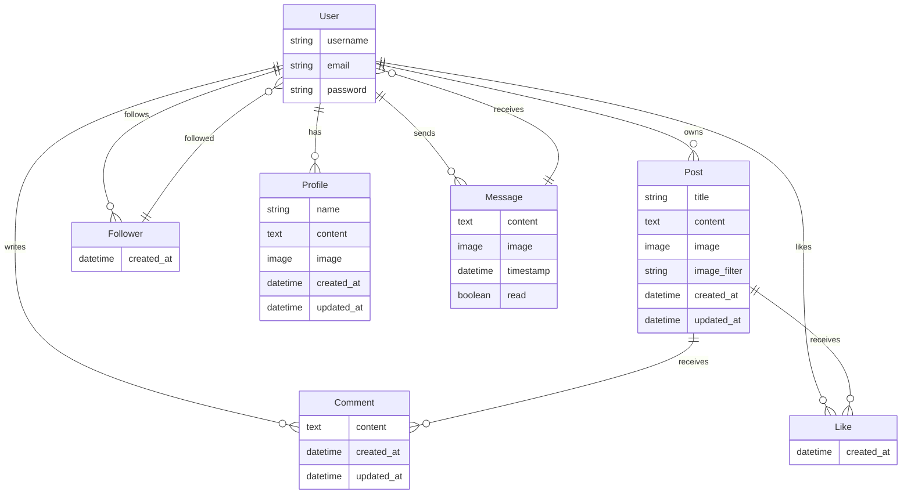

API Model Diagram:

```mermaid
erDiagram
    User {
        string username
        string email
        string password
    }
    Post {
        string title
        text content
        image image
        string image_filter
        datetime created_at
        datetime updated_at
    }
    Comment {
        text content
        datetime created_at
        datetime updated_at
    }
    Follower {
        datetime created_at
    }
    Like {
        datetime created_at
    }
    Profile {
        string name
        text content
        image image
        datetime created_at
        datetime updated_at
    }
    Message {
        text content
        image image
        datetime timestamp
        boolean read
    }

    User ||--o{ Post : owns
    User ||--o{ Comment : writes
    User ||--o{ Like : likes
    User ||--o{ Follower : follows
    User ||--o{ Profile : has
    User ||--o{ Message : sends
    Post ||--o{ Comment : receives
    Post ||--o{ Like : receives
    Follower ||--o{ User : followed
    Message ||--o{ User : receives
```