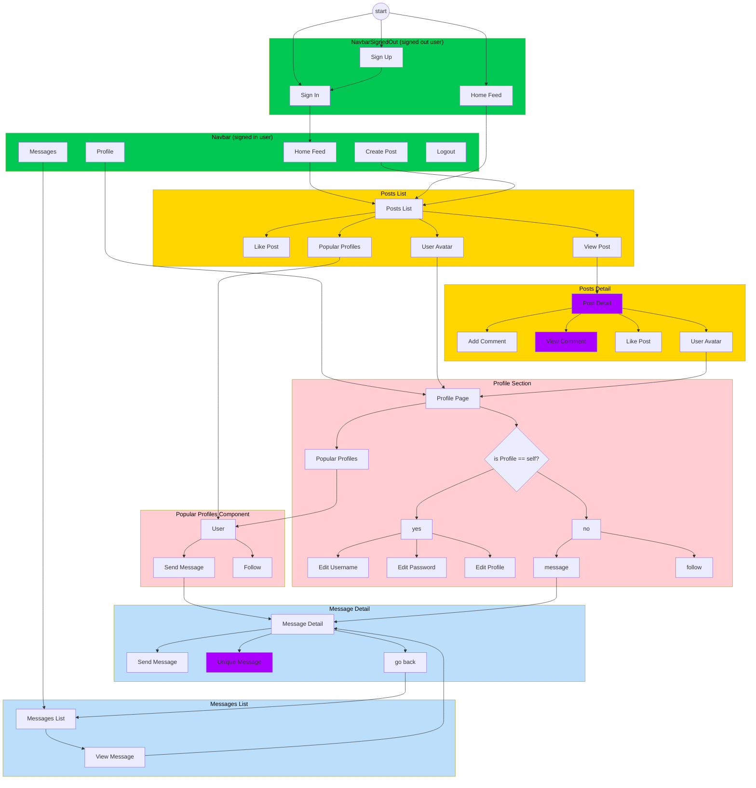
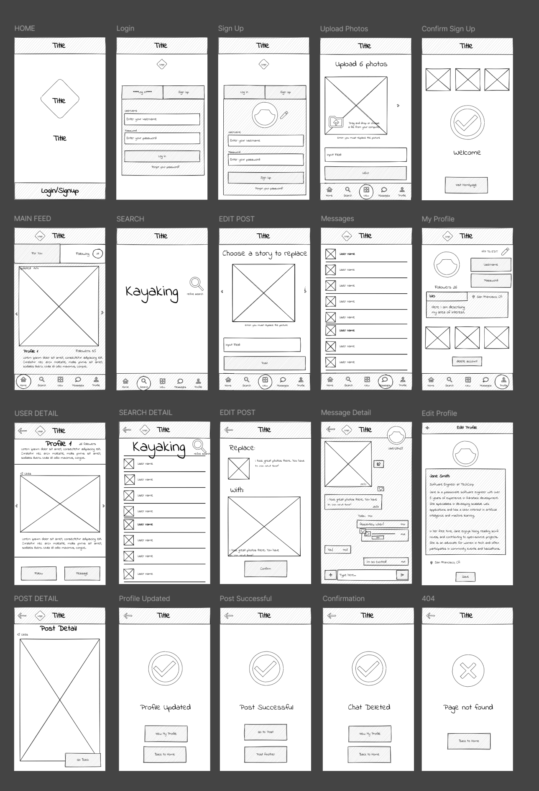
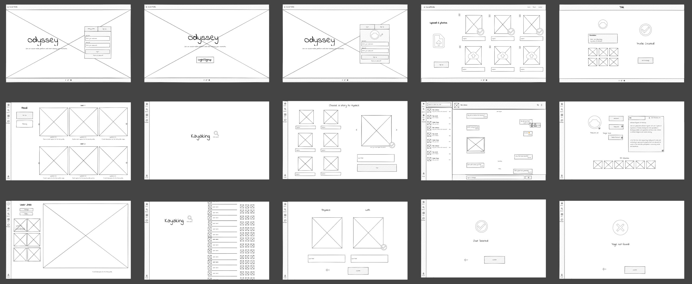
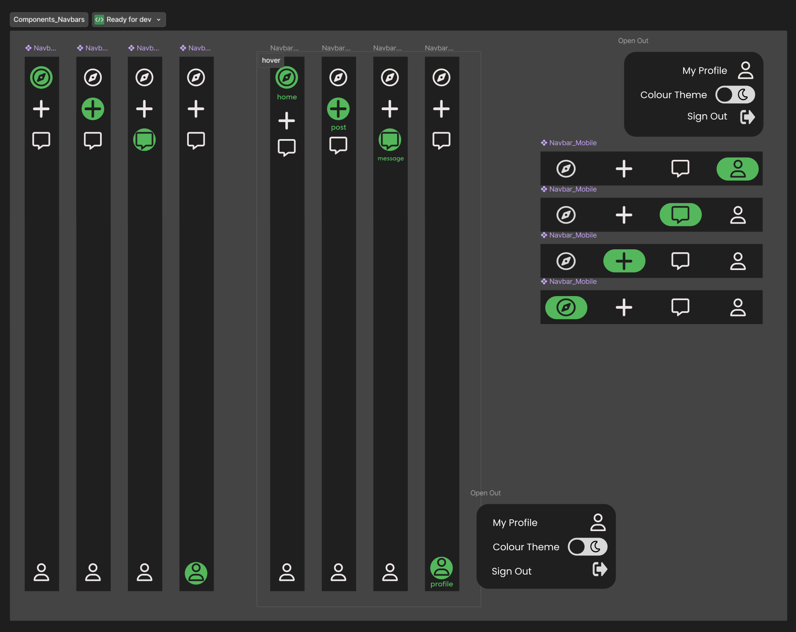
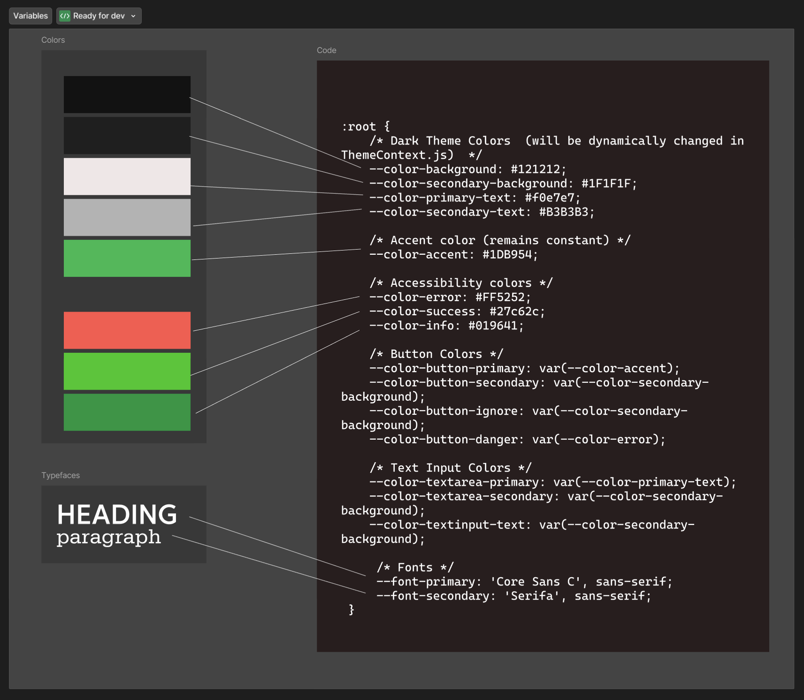

# **Frontend Readme** <!-- omit from toc -->

this readme is loosely structured according to the 5 User Experience Planes.

## Epics and User Stories (Strategy and Scope Plane)
The user stories are covered in the Agile Methodology.

- **As a user**, I can sign up and log into the app to access my personalized messaging dashboard.
- **As a user**, I can view a list of all my ongoing conversations and quickly access any of them.
- **As a user**, I can start a new conversation with another user by sending the first message.
- **As a user**, I can send and receive messages in real-time within an ongoing conversation.
- **As a user**, I can view detailed information about a conversation, including its history and any attached media.

## Structure of the Application





Website Navigation for signed in user

Purple indicates that the user can EDIT or DELETE the content, providing they are the owner.

Authentication was omitted from the diagram for readability. To summarise:
- The signed out Navbar offers option to SIGN IN or SIGN UP.
- Once signed in, the user can sign out in the navbar.
- A signed out user
  - cannot access messages
  - cannot see options for like or follow
  - cannot create or edit a post

### Inputs and Validation

| Feature | Input Fields | Frontend Validation | Backend Validation |
|---------|--------------|---------------------|---------------------|
| Sign Up | - Username (required)<br>- Password (required)<br>- Password confirmation (required) | File: `frontend/src/pages/auth/SignUpForm.js`<br>- Checks for field completion<br>- Displays server-side errors <br>- Field may not be blank <br> -Username cannot contain spaces <br> - displays Bootstrap Alerts such as `{errors.non_field_errors?.map((message, idx) => ( <Alert key={idx} > {message} </Alert> ))}` | Files: `drf_api/settings.py`, `drf_api/serializers.py`<br>- Uses default dj-rest-auth registration validators with `AUTH_PASSWORD_VALIDATORS`<br>- Creates profile via signal in drf_api app<br>- Django's default password validators apply, quoted here from docs: <br><br> - **UserAttributeSimilarityValidator**: Checks the similarity between the password and a set of attributes of the user.<br>- **MinimumLengthValidator**: Checks whether the password meets a minimum length. This validator is configured with a custom option: it now requires the minimum length to be nine characters, instead of the default eight.<br>- **CommonPasswordValidator**: Checks whether the password occurs in a list of common passwords. By default, it compares to an included list of 20,000 common passwords.<br>- **NumericPasswordValidator**: Checks whether the password isn’t entirely numeric.|
| Sign In | - Username (required)<br>- Password (required) | File: `frontend/src/pages/auth/SignInForm.js`<br>- Checks for field completion<br>- Handles authentication errors that may arise from `dj-rest-auth` in the API | File: `drf_api/urls.py`<br>- Uses dj-rest-auth for login<br>-`dj-rest-auth` framework uses Django's [`authenticate()` method](https://docs.djangoproject.com/en/5.1/topics/auth/default/#django.contrib.auth.authenticate) to ensure username and password match the database.
| Create Post | - Title (required)<br>- Content (optional)<br>- Image (optional) | File: `frontend/src/pages/posts/PostCreateForm.js`<br>- Checks title is not empty<br>- Client-side image preview | Files: `posts/serializers.py`, `posts/models.py`<br>- Validates image size (max 2MB) and dimensions (max 4096px in width or height)<br>- Handles image upload to Cloudinary<br>- Uses function to get default image if none provided |
| Send Message | - Content (required for text)<br>- Image (optional) | File: `frontend/src/pages/messaging/MessageDetailSendForm.js`<br>- Ensures content or image is present<br>- Handles image upload | Files: `messaging/views/message_detail_send_view.py`, `messaging/serializers.py`<br>- Validates message creation and recipient existence<br>- Validates content is not blank when no image<br>- Validates image upload (max 5MB, file type) |
| Update Profile | - Name (optional)<br>- Content/Bio (optional)<br>- Image (optional) | File: `frontend/src/pages/profiles/ProfileEditForm.js`<br>- Handles image upload and preview | File: `profiles/serializers.py`<br>- Validates image upload to Cloudinary<br>- No explicit validation on name and content fields |
| Like/Unlike Post | - No input (toggle action) | File: `frontend/src/pages/posts/Post.js`<br>- UI toggle for like/unlike<br>- Updates like count | Files: `likes/models.py`, `likes/serializers.py`, `likes/views.py`<br>- Ensures uniqueness with `unique_together` in model<br>- `LikeSerializer` handles uniqueness in create method<br>- Handles creation and deletion of Like objects |
| Follow/Unfollow User | - No input (toggle action) | File: `frontend/src/pages/profiles/Profile.js`<br>- UI toggle for follow/unfollow | Files: `followers/models.py`, `followers/serializers.py`, `followers/views.py`<br>- Ensures uniqueness with `unique_together` in model<br>- `FollowerSerializer` handles uniqueness in create method<br>- Manages Follower object creation and deletion |
| Update Username | - New Username (required) | File: `frontend/src/pages/profiles/UsernameForm.js`<br>- Checks new username is not empty<br>- Displays server-side errors | File: `drf_api/urls.py`<br>- Uses dj-rest-auth for username update<br>- Django's built-in uniqueness validation applies |
| Update Password | - Current Password (required)<br>- New Password (required)<br>- Confirm New Password | File: `frontend/src/pages/profiles/UserPasswordForm.js`<br>- Ensures all fields are filled<br>- Checks new passwords match | File: `drf_api/urls.py`<br>- Uses dj-rest-auth for password change<br>- Django's built-in password validators apply |

Both frontend and backend implement validation to ensure data integrity and security. The frontend provides immediate feedback to users, while the backend performs thorough checks before processing the data. Error messages from the server are caught by the frontend and displayed to the user for a seamless experience.

## Responsive Design

To make the app, `react-bootstrap` was used for an efficient workflow.

Where possible the app was designed with a mobile-first approach, ensuring that the app is responsive and accessible across devices.

### UiZard Wireframe

The following UiZard wireframe was used as a starting point for the app's design:


Mobile Design


Desktop Design

The wireframe shows the basic layout of the app, including the navbar, message list, and message detail components. The final design was based on this wireframe, with additional features and styling added to enhance the user experience.


### Responsive Navbar for Mobile and Desktop

for the Navbar a desktop and mobile component was created to ensure a seamless experience across devices. Then through a hook the Navbar would switch according to screenwidth.

## Surface Rendering

Global vars were used to efficently manage the color scheme and typography.

### NavBar Design

Figma was used to create a more detailed wireframe for the app, due to time constraints certain components were focused on.



### Color Scheme and Typefaces with Root vars



these were used to create a consistent and visually appealing design for the app, as shown in the image the variables stylesheet was used to set the color scheme and typography for the app. This provided an efficient workflow.

### Light and Dark Mode with ThemeContext

Odyssey implements a dynamic theme switching feature using React Context. This system allows for seamless toggling between light and dark modes across the application. Let's dive into how this is implemented.

The theming system is primarily implemented in the `frontend/src/contexts/ThemeContext.js` file. Here's a breakdown of its key components:

The `ThemeContext` is created using React's `createContext` function:

```javascript
export const ThemeContext = createContext();
```

This context will hold the current theme state and provide a method to toggle it.

The `ThemeProvider` component is responsible for managing the theme state and providing it to the rest of the application:

```javascript
export const ThemeProvider = ({ children }) => {
  const [lightMode, setLightMode] = useState(() => {
    const savedMode = localStorage.getItem('lightMode');
    return savedMode ? JSON.parse(savedMode) : false;
  });

  const applyTheme = useCallback((isLight) => {
    const root = document.documentElement;

    if (isLight) {
      root.style.setProperty('--color-background', '#FFFFFF');
      root.style.setProperty('--color-secondary-background', '#F0F0F0');
      root.style.setProperty('--color-primary-text', '#333333');
      root.style.setProperty('--color-secondary-text', '#666666');
    } else {
      root.style.setProperty('--color-background', '#121212');
      root.style.setProperty('--color-secondary-background', '#1F1F1F');
      root.style.setProperty('--color-primary-text', '#f0e7e7');
      root.style.setProperty('--color-secondary-text', '#B3B3B3');
    }
  }, []);

  useEffect(() => {
    localStorage.setItem('lightMode', JSON.stringify(lightMode));
    applyTheme(lightMode);
  }, [lightMode, applyTheme]);

  return (
    <ThemeContext.Provider value={{ lightMode, setLightMode }}>
      {children}
    </ThemeContext.Provider>
  );
};
```

Key points:
- The initial theme state is retrieved from localStorage, defaulting to dark mode if not set.
- The `applyTheme` function updates CSS custom properties based on the current theme.
- Theme changes are persisted to localStorage and applied immediately.

**useThemeTransition Hook**

This custom hook provides a way to apply theme transition effects:

```javascript
export const useThemeTransition = () => {
  return { 'data-theme-transition': true };
};
```

**Theme Application**

The theme is applied using CSS custom properties defined in `frontend/src/styles/themeTransitions.css`:

```css
[data-theme-transition] {
  transition: background-color 0.3s ease, color 0.3s ease;
}

:root {
  --color-background: #121212;
  --color-secondary-background: #1F1F1F;
  --color-primary-text: #f0e7e7;
  --color-secondary-text: #B3B3B3;
}
```

These CSS variables are dynamically updated by the `applyTheme` function in the `ThemeProvider`.

Components can access and toggle the theme using the `ThemeContext`. For example, in `frontend/src/components/NavBarDesktop.js`:

```javascript
import React, { useContext } from "react";
import { ThemeContext } from "../contexts/ThemeContext";
import { FontAwesomeIcon } from '@fortawesome/react-fontawesome';
import { faSun, faMoon } from '@fortawesome/free-solid-svg-icons';

const NavBarDesktop = () => {
  const { lightMode, setLightMode } = useContext(ThemeContext);

  const toggleTheme = () => {
    setLightMode(!lightMode);
  };

  return (
    // ... other nav elements ...
    <button onClick={toggleTheme} className={styles.ThemeToggle}>
      <FontAwesomeIcon icon={lightMode ? faMoon : faSun} />
    </button>
    // ... other nav elements ...
  );
};
```

</details>

This implementation allows for a seamless theme switching experience across the Odyssey application, with the current theme persisting between sessions.

