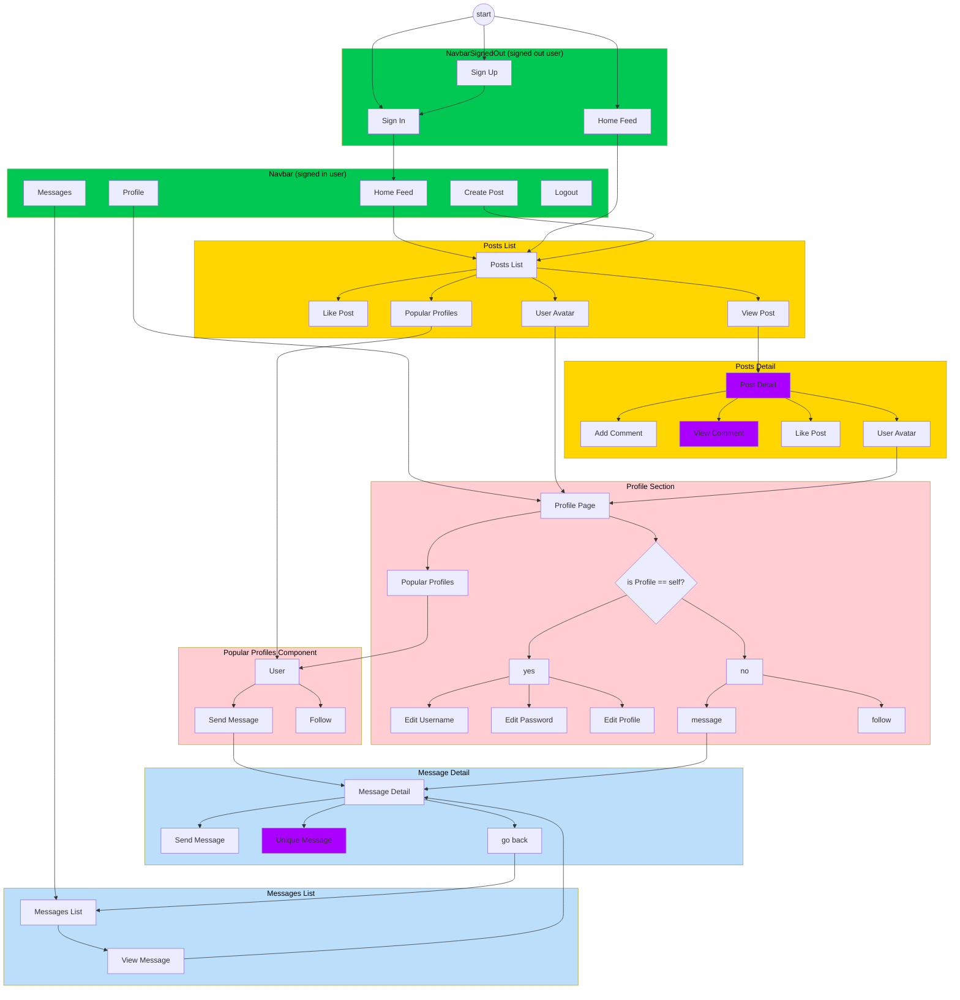

<center>

# **Odyssey** <!-- omit from toc -->

Odyssey is a social media application with a messaging feature.

<!-- GitHub shields for React, CSS, JavaScript, Cloudinary, Django Rest Framework -->

    


   
***

The documentation is split into two parts: the frontend and the backend.

This Readme Documents the Frontend of the Odyssey Messaging App. 

The Backend is documented in the [Odyssey API Readme](https://github.com/lmcrean/odyssey-api$$$$$$$$$$$).

---

**[This Readme is best viewed in Docsify](https://docsify-this.net/?basePath=https://raw.githubusercontent.com/lmcrean/odyssey-docs/main&homepage=readme_react.md&sidebar=true&browser-tab-title=Odyssey&loadSidebar=_sidebar.md&searchbox=true&subMaxLevel=3&page-title=Odyssey&dark-mode=true&link-color-dark-mode=70b9e0#/)**

---

# **Introduction** <!-- omit from toc -->

</center>

# Table of Contents <!-- omit from toc -->
- [1. **Features**](#1-features)
  - [1.1. Messaging](#11-messaging)
  - [1.2. Posts](#12-posts)
  - [1.3. User Authentication](#13-user-authentication)
  - [1.4. Profiles](#14-profiles)
  - [1.5. Follows and Likes](#15-follows-and-likes)
- [2. **User Experience**](#2-user-experience)
  - [2.1. User Stories (Strategy and Scope Plane)](#21-user-stories-strategy-and-scope-plane)
  - [2.2. Structure of the Application](#22-structure-of-the-application)
    - [Inputs and Validation](#inputs-and-validation)
    - [Inputs and Validation](#inputs-and-validation-1)
  - [2.3. Skeleton](#23-skeleton)
    - [2.3.1. UiZard Wireframe](#231-uizard-wireframe)
    - [2.3.2. Responsive Navbar for Mobile and Desktop](#232-responsive-navbar-for-mobile-and-desktop)
  - [2.4. Surface](#24-surface)
    - [2.4.1. NavBar Design](#241-navbar-design)
    - [2.4.2. Color Scheme and Typefaces with Root vars](#242-color-scheme-and-typefaces-with-root-vars)
    - [2.4.3. Light and Dark Mode with ThemeContext](#243-light-and-dark-mode-with-themecontext)
    - [2.4.4. ThemeContext](#244-themecontext)
    - [2.4.5. ThemeProvider](#245-themeprovider)
- [3. Frontend Directory Structure](#3-frontend-directory-structure)
  - [3.1. `frontend/cypress/`](#31-frontendcypress)
  - [3.2. `frontend/node_modules/`](#32-frontendnode_modules)
  - [3.3. `frontend/playwright/`](#33-frontendplaywright)
  - [3.4. `frontend/public/`](#34-frontendpublic)
  - [3.5. `frontend/screenshots/`](#35-frontendscreenshots)
  - [3.6. `frontend/src/`](#36-frontendsrc)
    - [3.6.1. `frontend/src/api/`](#361-frontendsrcapi)
    - [3.6.2. `frontend/src/assets/`](#362-frontendsrcassets)
    - [3.6.3. `frontend/src/components/`](#363-frontendsrccomponents)
    - [3.6.4. `frontend/src/contexts/`](#364-frontendsrccontexts)
    - [3.6.5. `frontend/src/fonts/`](#365-frontendsrcfonts)
    - [3.6.6. `frontend/src/hooks/`](#366-frontendsrchooks)
    - [3.6.7. `frontend/src/mocks/`](#367-frontendsrcmocks)
    - [3.6.8. `frontend/src/pages/`](#368-frontendsrcpages)
      - [3.6.8.1. `frontend/src/pages/auth/`](#3681-frontendsrcpagesauth)
      - [3.6.8.2. `frontend/src/pages/comments/`](#3682-frontendsrcpagescomments)
      - [3.6.8.3. `frontend/src/pages/messaging/`](#3683-frontendsrcpagesmessaging)
      - [3.6.8.4. `frontend/src/pages/posts/`](#3684-frontendsrcpagesposts)
      - [3.6.8.5. `frontend/src/pages/profiles/`](#3685-frontendsrcpagesprofiles)
    - [3.6.9. `frontend/src/styles/`](#369-frontendsrcstyles)
      - [3.6.9.1. `frontend/src/styles/modules/`](#3691-frontendsrcstylesmodules)
    - [3.6.10. `frontend/src/utils/`](#3610-frontendsrcutils)
  - [3.7. `frontend/test-results/`](#37-frontendtest-results)
- [4. **Automatic Testing**](#4-automatic-testing)
  - [4.1. Test Summaries](#41-test-summaries)
- [5. **Installation**](#5-installation)
  - [5.1. Note on compiling static files](#51-note-on-compiling-static-files)
- [6. Agile Methodology](#6-agile-methodology)
- [7. **Acknowledgement and Credits**](#7-acknowledgement-and-credits)
  - [7.1. Code Institute Moments app as boilerplate](#71-code-institute-moments-app-as-boilerplate)
  - [7.2. Code institute Repo unification tutorial](#72-code-institute-repo-unification-tutorial)
  - [7.2. Libraries](#72-libraries)
  - [7.3. Broader Software used](#73-broader-software-used)
  - [7.4. Use of LLMs](#74-use-of-llms)
  - [7.5. Personal Acknowledgements](#75-personal-acknowledgements)
- [8. License](#8-license)

---

# 1. **Features**

## 1.1. Messaging

- **Real-Time Messaging**: Engage in instant messaging with individuals or groups.

- **Message List**: View and scroll through a list of your active conversations.

- **Detailed Conversations**: Dive into specific messages within conversations, including media sharing.
- **Message Forms**: Easily send new messages in active conversations or start new conversations with others.

## 1.2. Posts 

- Users can create posts and share them with their followers.
- They can share images and text in their posts.

## 1.3. User Authentication

- Users can sign up and log into the app to access their personalized dashboard.

## 1.4. Profiles

- Users can view detailed profiles of other users, which lists their posts
- Users can customise their own profiles with a profile picture and bio.
- The profile picture appears on posts and in the message section.

## 1.5. Follows and Likes

- Users can follow other users and like their posts.
- 

# 2. **User Experience**

## 2.1. User Stories (Strategy and Scope Plane)
The user stories are covered in the Agile Methodology.

- **As a user**, I can sign up and log into the app to access my personalized messaging dashboard.
- **As a user**, I can view a list of all my ongoing conversations and quickly access any of them.
- **As a user**, I can start a new conversation with another user by sending the first message.
- **As a user**, I can send and receive messages in real-time within an ongoing conversation.
- **As a user**, I can view detailed information about a conversation, including its history and any attached media.

## 2.2. Structure of the Application



Website Navigation for signed in user

Purple indicates that the user can EDIT or DELETE the content, providing they are the owner.

Authentication was omitted from the diagram for readability. To summarise:
- The signed out Navbar offers option to SIGN IN or SIGN UP.
- Once signed in, the user can sign out in the navbar.
- A signed out user
  - cannot access messages
  - cannot see options for like or follow
  - cannot create or edit a post

### Inputs and Validation
### Inputs and Validation

| Feature | Input Fields | Frontend Validation | Backend Validation |
|---------|--------------|---------------------|---------------------|
| Sign Up | - Username (required)<br>- Password (required)<br>- Password confirmation (required) | File: `frontend/src/pages/auth/SignUpForm.js`<br>- Checks for field completion<br>- Displays server-side errors | Files: `drf_api/settings.py`, `drf_api/serializers.py`<br>- Uses default dj-rest-auth registration<br>- Creates profile via signal in drf_api app<br>- Django's default password validators apply |
| Sign In | - Username (required)<br>- Password (required) | File: `frontend/src/pages/auth/SignInForm.js`<br>- Checks for field completion<br>- Handles authentication errors | File: `drf_api/urls.py`<br>- Uses dj-rest-auth for login<br>- Authenticates credentials against the database |
| Create Post | - Title (required)<br>- Content (optional)<br>- Image (optional) | File: `frontend/src/pages/posts/PostCreateForm.js`<br>- Checks title is not empty<br>- Client-side image preview | Files: `posts/serializers.py`, `posts/models.py`<br>- Validates image size (max 2MB) and dimensions (max 4096px in width or height)<br>- Handles image upload to Cloudinary<br>- Uses function to get default image if none provided |
| Send Message | - Content (required for text)<br>- Image (optional) | File: `frontend/src/pages/messaging/MessageDetailSendForm.js`<br>- Ensures content or image is present<br>- Handles image upload | Files: `messaging/views/message_detail_send_view.py`, `messaging/serializers.py`<br>- Validates message creation and recipient existence<br>- Validates content is not blank when no image<br>- Validates image upload (max 5MB, file type) |
| Update Profile | - Name (optional)<br>- Content/Bio (optional)<br>- Image (optional) | File: `frontend/src/pages/profiles/ProfileEditForm.js`<br>- Handles image upload and preview | File: `profiles/serializers.py`<br>- Validates image upload to Cloudinary<br>- No explicit validation on name and content fields |
| Like/Unlike Post | - No input (toggle action) | File: `frontend/src/pages/posts/Post.js`<br>- UI toggle for like/unlike<br>- Updates like count | Files: `likes/models.py`, `likes/serializers.py`, `likes/views.py`<br>- Ensures uniqueness with `unique_together` in model<br>- `LikeSerializer` handles uniqueness in create method<br>- Handles creation and deletion of Like objects |
| Follow/Unfollow User | - No input (toggle action) | File: `frontend/src/pages/profiles/Profile.js`<br>- UI toggle for follow/unfollow | Files: `followers/models.py`, `followers/serializers.py`, `followers/views.py`<br>- Ensures uniqueness with `unique_together` in model<br>- `FollowerSerializer` handles uniqueness in create method<br>- Manages Follower object creation and deletion |
| Update Username | - New Username (required) | File: `frontend/src/pages/profiles/UsernameForm.js`<br>- Checks new username is not empty<br>- Displays server-side errors | File: `drf_api/urls.py`<br>- Uses dj-rest-auth for username update<br>- Django's built-in uniqueness validation applies |
| Update Password | - Current Password (required)<br>- New Password (required)<br>- Confirm New Password | File: `frontend/src/pages/profiles/UserPasswordForm.js`<br>- Ensures all fields are filled<br>- Checks new passwords match | File: `drf_api/urls.py`<br>- Uses dj-rest-auth for password change<br>- Django's built-in password validators apply |

Both frontend and backend implement validation to ensure data integrity and security. The frontend provides immediate feedback to users, while the backend performs thorough checks before processing the data. Error messages from the server are caught by the frontend and displayed to the user for a seamless experience.

## 2.3. Skeleton

To make the app, `react-bootstrap` was used for an efficient workflow.

Where possible the app was designed with a mobile-first approach, ensuring that the app is responsive and accessible across devices.

### 2.3.1. UiZard Wireframe

The following UiZard wireframe was used as a starting point for the app's design:


Mobile Design


Desktop Design

The wireframe shows the basic layout of the app, including the navbar, message list, and message detail components. The final design was based on this wireframe, with additional features and styling added to enhance the user experience.


### 2.3.2. Responsive Navbar for Mobile and Desktop

for the Navbar a desktop and mobile component was created to ensure a seamless experience across devices. Then through a hook the Navbar would switch according to screenwidth.

## 2.4. Surface

Global vars were used to efficently manage the color scheme and typography.

### 2.4.1. NavBar Design

Figma was used to create a more detailed wireframe for the app, due to time constraints certain components were focused on.


### 2.4.2. Color Scheme and Typefaces with Root vars


these were used to create a consistent and visually appealing design for the app, as shown in the image the variables stylesheet was used to set the color scheme and typography for the app. This provided an efficient workflow.

### 2.4.3. Light and Dark Mode with ThemeContext

Odyssey implements a dynamic theme switching feature using React Context. This system allows for seamless toggling between light and dark modes across the application. Let's dive into how this is implemented.

The theming system is primarily implemented in the `frontend/src/contexts/ThemeContext.js` file. Here's a breakdown of its key components:

### 2.4.4. ThemeContext

The `ThemeContext` is created using React's `createContext` function:

```javascript
export const ThemeContext = createContext();
```

This context will hold the current theme state and provide a method to toggle it.

### 2.4.5. ThemeProvider

The `ThemeProvider` component is responsible for managing the theme state and providing it to the rest of the application:

```javascript
export const ThemeProvider = ({ children }) => {
  const [lightMode, setLightMode] = useState(() => {
    const savedMode = localStorage.getItem('lightMode');
    return savedMode ? JSON.parse(savedMode) : false;
  });

  const applyTheme = useCallback((isLight) => {
    const root = document.documentElement;

    if (isLight) {
      root.style.setProperty('--color-background', '#FFFFFF');
      root.style.setProperty('--color-secondary-background', '#F0F0F0');
      root.style.setProperty('--color-primary-text', '#333333');
      root.style.setProperty('--color-secondary-text', '#666666');
    } else {
      root.style.setProperty('--color-background', '#121212');
      root.style.setProperty('--color-secondary-background', '#1F1F1F');
      root.style.setProperty('--color-primary-text', '#f0e7e7');
      root.style.setProperty('--color-secondary-text', '#B3B3B3');
    }
  }, []);

  useEffect(() => {
    localStorage.setItem('lightMode', JSON.stringify(lightMode));
    applyTheme(lightMode);
  }, [lightMode, applyTheme]);

  return (
    <ThemeContext.Provider value={{ lightMode, setLightMode }}>
      {children}
    </ThemeContext.Provider>
  );
};
```

Key points:
- The initial theme state is retrieved from localStorage, defaulting to dark mode if not set.
- The `applyTheme` function updates CSS custom properties based on the current theme.
- Theme changes are persisted to localStorage and applied immediately.

**useThemeTransition Hook**

This custom hook provides a way to apply theme transition effects:

```javascript
export const useThemeTransition = () => {
  return { 'data-theme-transition': true };
};
```

**Theme Application**

The theme is applied using CSS custom properties defined in `frontend/src/styles/themeTransitions.css`:

```css
[data-theme-transition] {
  transition: background-color 0.3s ease, color 0.3s ease;
}

:root {
  --color-background: #121212;
  --color-secondary-background: #1F1F1F;
  --color-primary-text: #f0e7e7;
  --color-secondary-text: #B3B3B3;
}
```

These CSS variables are dynamically updated by the `applyTheme` function in the `ThemeProvider`.

Components can access and toggle the theme using the `ThemeContext`. For example, in `frontend/src/components/NavBarDesktop.js`:

```javascript
import React, { useContext } from "react";
import { ThemeContext } from "../contexts/ThemeContext";
import { FontAwesomeIcon } from '@fortawesome/react-fontawesome';
import { faSun, faMoon } from '@fortawesome/free-solid-svg-icons';

const NavBarDesktop = () => {
  const { lightMode, setLightMode } = useContext(ThemeContext);

  const toggleTheme = () => {
    setLightMode(!lightMode);
  };

  return (
    // ... other nav elements ...
    <button onClick={toggleTheme} className={styles.ThemeToggle}>
      <FontAwesomeIcon icon={lightMode ? faMoon : faSun} />
    </button>
    // ... other nav elements ...
  );
};
```

</details>

This implementation allows for a seamless theme switching experience across the Odyssey application, with the current theme persisting between sessions.

# 3. Frontend Directory Structure

The frontend directory structure is designed to organize the React application's codebase effectively. Here's an overview of the key directories and their purposes:

## 3.1. `frontend/cypress/`
- Contains end-to-end tests using Cypress
- Includes test specifications like `cypress/e2e/auth.cy.js` for authentication testing
- Configuration in `cypress.config.js` sets up the testing environment

## 3.2. `frontend/node_modules/`
- Contains all the npm packages and dependencies installed via `npm install`
- Managed by `npm`, not typically modified directly
- Essential for running the application and its development environment

## 3.3. `frontend/playwright/`
- Houses browser automation and testing scripts using Playwright
- Includes tests like `playwright/auth.spec.js` for cross-browser authentication testing
- Configured via `playwright.config.js` for multi-browser support

## 3.4. `frontend/public/`
- Contains static assets that are publicly accessible
- Includes `index.html`, `favicon.ico`, and other static resources
- Files here are served directly without being processed by webpack

## 3.5. `frontend/screenshots/`
- Stores screenshots taken during automated tests
- Useful for visual regression testing and debugging
- Screenshots are typically named based on the test, e.g., `auth-test-failed-1.png`

## 3.6. `frontend/src/`
The main source code directory for the React application. Contains various subdirectories:

### 3.6.1. `frontend/src/api/`
- Handles API configurations and defaults
- `axiosDefaults.js` sets up base URL and default headers for API requests

### 3.6.2. `frontend/src/assets/`
- Stores static assets like `logo.png` and `upload.png`
- Includes images and icons used throughout the application

### 3.6.3. `frontend/src/components/`
- Contains reusable React components
- Includes components like `Asset.js`, `Avatar.js`, and `NavBar.js`
- `MoreDropdown.js` provides a reusable dropdown menu component

### 3.6.4. `frontend/src/contexts/`
Holds React context providers for state management:

- `CurrentUserContext.js`: Manages user authentication state
- `ProfileDataContext.js`: Handles profile data and follow/unfollow functionality
- `PostCacheContext.js`: Implements post caching for performance
- `AnimationLoadingContext.js`: Manages animation loading states
- `ThemeContext.js`: Controls app-wide theme settings (light/dark mode)

### 3.6.5. `frontend/src/fonts/`
- Stores custom font files like `Fontspring-DEMO-coresansc65.otf`
- Ensures consistent typography across the app

### 3.6.6. `frontend/src/hooks/`
- Contains custom React hooks like `useClickOutsideToggle.js` and `useRedirect.js`
- `useWindowSize.js` provides responsive design utilities

### 3.6.7. `frontend/src/mocks/`
- Includes mock data and handlers in `handlers.js` for testing
- Simulates API responses for consistent testing environments

### 3.6.8. `frontend/src/pages/`
Contains page components organized by feature:

#### 3.6.8.1. `frontend/src/pages/auth/`
- `SignInForm.js` and `SignUpForm.js` manage user authentication

#### 3.6.8.2. `frontend/src/pages/comments/`
- `Comment.js`, `CommentCreateForm.js`, and `CommentEditForm.js` handle comment functionality

#### 3.6.8.3. `frontend/src/pages/messaging/`
- `Message.js`, `MessageList.js`, `MessageDetail.js` manage the messaging feature
- `MessageDetailSendForm.js` handles sending new messages

#### 3.6.8.4. `frontend/src/pages/posts/`
- `Post.js`, `PostCreateForm.js`, `PostEditForm.js` manage post CRUD operations
- `PostsPage.js` displays the main feed of posts

#### 3.6.8.5. `frontend/src/pages/profiles/`
- `Profile.js`, `ProfileEditForm.js` handle user profile management
- `PopularProfiles.js` showcases popular user profiles

### 3.6.9. `frontend/src/styles/`
- `variables.css` defines global CSS variables for consistent styling
- `base.css` provides base styles for the app such as fonts, colors and fallbacks

#### 3.6.9.1. `frontend/src/styles/modules/`
- Houses component-specific CSS module files
- Examples include:
  - `Post.module.css` for styling post components
  - `Profile.module.css` for profile-related styles
  - `MessageList.module.css` for message list styling
  - `NavBarDesktop.module.css` and `NavBarMobile.module.css` for responsive navigation styling
- Each module corresponds to a specific component, enabling scoped styling
- there is an `animations` folder containing CSS files for custom animations
- `LikeAnimation.module.css` defines styles for the post liking animation

### 3.6.10. `frontend/src/utils/`
- `utils.js` contains utility functions like `fetchMoreData` for infinite scrolling

## 3.7. `frontend/test-results/`
- Stores test results, often in JSON format like `test-results.json`
- Useful for analyzing test outcomes and generating reports

This structure organizes the frontend code into logical sections, promoting maintainability and scalability. Each directory and file serves a specific purpose in creating a robust React application.

# 4. **Automatic Testing**
The app includes automatic tests for core components and functionality using testing frameworks like Jest. 

- To run tests, use the following command:
  ```bash
  npm test
  ```
- Tests cover components like message forms, message lists, and detail views to ensure the integrity of the app's messaging functionality.


```bash
 PASS  src/pages/messaging/__tests__/MessageDetailSendFormAPI.test.js
 PASS  src/pages/auth/__tests__/SignUpForm.test.js (5.295 s)
 PASS  src/pages/messaging/__tests__/MessageWithImage.test.js (5.58 s)
 PASS  src/pages/messaging/__tests__/Message.test.js (5.51 s)
 PASS  src/pages/messaging/__tests__/MessageDetailSendForm.test.js (5.992 s)
 PASS  src/App.test.js (6.04 s)

Test Suites: 6 passed, 6 total
Tests:       10 passed, 10 total
Snapshots:   0 total
Time:        7.916 s
Ran all test suites.
```

Here's a summary of the test files and what they cover:

## 4.1. Test Summaries
| Test File | Description | Key Methodologies |
|-----------|-------------|-------------------|
| Message.test.js | - Tests fetching and displaying the sender's username<br>- Checks error handling when fetching username fails<br>- Verifies the opening and closing of the delete modal<br>- Ensures proper rendering of message content and metadata | - Mocking API responses (axios)<br>- Rendering components with React Testing Library<br>- Simulating user interactions (fireEvent)<br>- Asynchronous testing (act, waitFor)<br>- Snapshot testing for UI consistency |
| MessageDetailSendForm.test.js | - Tests the submission of a message with an image<br>- Verifies form data handling and API call formation | - Mocking API calls (axiosReq)<br>- Form submission testing<br>- File input handling<br>- Asynchronous testing (waitFor)<br>- Checking API call parameters |
| MessageDetailSendFormAPI.test.js | - Mocks and tests the API call for sending a message with an image<br>- Verifies the structure and content of the API response | - Mocking Axios for API calls<br>- Testing API endpoint and payload<br>- Verifying response structure<br>- Handling FormData in tests |
| MessageWithImage.test.js | - Tests the rendering of a message component with an attached image<br>- Verifies the correct display of message content and image | - Rendering components with React Testing Library<br>- Mocking Context API (useCurrentUser)<br>- Asynchronous component testing (act)<br>- Testing image rendering and attributes |
| SignUpForm.test.js | - Tests the rendering of the sign-up form<br>- Checks form validation and error display<br>- Verifies form submission and redirection on success | - Rendering components with React Testing Library<br>- Mocking API calls (axios)<br>- Simulating form input and submission<br>- Testing error handling and display<br>- Checking navigation/redirection (useHistory mock) |

The most common methodologies used in testing were mocking API calls with `axios` and `jest.mock`, rendering components with `React Testing Library`, simulating user interactions with `fireEvent`, and handling asynchronous testing with `act` and `waitFor`. Asynchronous testing means that the test waits for a certain condition to be met before proceeding, ensuring that the app behaves as expected in real-world scenarios.


# 5. **Installation**

It would be advisable to use the [Gitpod IDE](http://gitpod.io) for the installation process, as it is pre-configured with the necessary tools and dependencies, especially around `nvm` and linking to the API.

To get the frontend app up and running locally, follow these steps:

1. **Clone the repository**:
   ```bash
   git clone http://github.com/lmcrean/odyssey_react.git
   ```
2. **Install dependencies**:
   Navigate to the project directory and install the required dependencies:
   ```bash
   npm install
   ```
3. **Install correct node version**:
   Run the following command to start the React app locally:
   ```bash
   nvm install 16
   ```
4. **Run build**:
   Run the following command to build the React app locally:
   ```bash
   npm run build
   ```
5. **Start the development server**:
   Run the following command to start the React app locally:
   ```bash
   npm start
   ```

## 5.1. Note on compiling static files

You will need to re-run this command any time you want to deploy changes to the static files in your project, including the React code. To do this, you need to delete the existing `build` folder and rebuild it.

This command will delete the old folder and replace it with the new one: 

```bash
npm run build && rm -rf ../staticfiles/build && mv build ../staticfiles/.
```

# 6. Agile Methodology

As seperate Readme file is created to cover the Agile Methodology. 

# 7. **Acknowledgement and Credits**

## 7.1. Code Institute Moments app as boilerplate

"Moments" was used as a boilerplate for the project as it contained the necessary features for a social media platform. Both the API and the React frontend were built from this code.
  - Frontend: https://github.com/Code-Institute-Solutions/moments
  - API:  https://github.com/Code-Institute-Solutions/drf-api

## 7.2. Code institute Repo unification tutorial

A key issue with the project was authnetication not working on Safari browsers, due to having seperate repositories with the frontend and API. 

- [Code Institute](https://codeinstitute.net/) provided a tutorial on how to unify the repositories, which was used to fix the issue.

## 7.2. Libraries

Below is a table listing the key dependencies and devDependencies used in this project, along with brief descriptions and links to the documentation that may have been refered.

| Dependency & Version                                          | Description                                                                                                                                                          |
|---------------------------------------------------------------|----------------------------------------------------------------------------------------------------------------------------------------------------------------------|
| **@fortawesome/fontawesome-svg-core==^6.6.0**                 | [@fortawesome/fontawesome-svg-core](https://www.npmjs.com/package/@fortawesome/fontawesome-svg-core) is the core package that enables FontAwesome icons in your project. |
| **@fortawesome/free-solid-svg-icons==^6.6.0**                 | [@fortawesome/free-solid-svg-icons](https://www.npmjs.com/package/@fortawesome/free-solid-svg-icons) provides solid style icons from FontAwesome.                     |
| **@fortawesome/react-fontawesome==^0.2.2**                    | [@fortawesome/react-fontawesome](https://www.npmjs.com/package/@fortawesome/react-fontawesome) is a React component library for FontAwesome icons.                    |
| **@testing-library/jest-dom==^5.14.1**                        | [@testing-library/jest-dom](https://www.npmjs.com/package/@testing-library/jest-dom) provides custom jest matchers for DOM node assertions.                           |
| **@testing-library/react==^11.2.7**                           | [@testing-library/react](https://www.npmjs.com/package/@testing-library/react) is a testing utility for React components.                                             |
| **@testing-library/user-event==^12.8.3**                      | [@testing-library/user-event](https://www.npmjs.com/package/@testing-library/user-event) simulates user interactions for testing purposes.                            |
| **axios==^0.21.4**                                            | [axios](https://www.npmjs.com/package/axios) is a promise-based HTTP client for making requests to servers.                                                           |
| **bootstrap==^4.6.0**                                         | [bootstrap](https://www.npmjs.com/package/bootstrap) is a popular front-end framework for building responsive, mobile-first sites.                                    |
| **heroku==^9.1.0**                                            | [heroku](https://www.npmjs.com/package/heroku) is a CLI for interacting with the Heroku platform.                                                                     |
| **jwt-decode==^3.1.2**                                        | [jwt-decode](https://www.npmjs.com/package/jwt-decode) is a small library for decoding JSON Web Tokens (JWT).                                                         |
| **react==^17.0.2**                                            | [react](https://www.npmjs.com/package/react) is a JavaScript library for building user interfaces.                                                                    |
| **react-bootstrap==^1.6.3**                                   | [react-bootstrap](https://www.npmjs.com/package/react-bootstrap) provides Bootstrap components built with React.                                                     |
| **react-dom==^17.0.2**                                        | [react-dom](https://www.npmjs.com/package/react-dom) is the entry point to the DOM and server renderers for React.                                                    |
| **react-infinite-scroll-component==^6.1.0**                   | [react-infinite-scroll-component](https://www.npmjs.com/package/react-infinite-scroll-component) helps implement infinite scrolling in React.                         |
| **react-router-dom==^5.3.0**                                  | [react-router-dom](https://www.npmjs.com/package/react-router-dom) is a library for handling routing in React applications.                                           |
| **react-scripts==4.0.3**                                      | [react-scripts](https://www.npmjs.com/package/react-scripts) provides scripts and configuration used by Create React App.                                             |
| **web-vitals==^1.1.2**                                        | [web-vitals](https://www.npmjs.com/package/web-vitals) is a library for measuring essential web performance metrics.                                                  |
| **@babel/plugin-proposal-private-property-in-object==^7.21.11** | [@babel/plugin-proposal-private-property-in-object](https://www.npmjs.com/package/@babel/plugin-proposal-private-property-in-object) adds support for private properties in objects. This cleared a warning message in the console. |
| **msw==^0.35.0**                                              | [msw](https://www.npmjs.com/package/msw) is a mocking library for intercepting network requests during testing.                                                       |


## 7.3. Broader Software used

| Software & Version | Description                                                                                   |
|--------------------|-----------------------------------------------------------------------------------------------|
| **Node.js**        | [Node.js](https://nodejs.org/en/) is a JavaScript runtime built on Chrome's V8 JavaScript engine. |
| **npm**            | [npm](https://www.npmjs.com/) is the package manager for JavaScript and the world's largest software registry. |
| **nvm**            | [nvm](https://github.com/nvm-sh/nvm) is a version manager for Node.js, allowing you to install and switch between multiple versions of Node.js. |
| **VSCode**         | [VSCode](https://code.visualstudio.com/) is a popular code editor that provides a range of features for efficient coding. |
| **Git**            | [Git](https://git-scm.com/) is a distributed version control system for tracking changes in source code during software development. |
| **GitHub**         | [GitHub](https://github.com/) is a platform for hosting and collaborating on Git repositories, providing tools for version control and project management. |
| **Heroku**         | [Heroku](https://www.heroku.com/) is a cloud platform that enables developers to build, deliver, monitor, and scale applications. |
| **Cloudinary**     | [Cloudinary](https://cloudinary.com/) is a cloud-based image and video management service that provides storage, optimization, and delivery solutions. |
| **PostgreSQL**     | [PostgreSQL](https://www.postgresql.org/) is a powerful, open-source object-relational database system. |
| **Gitpod**         | [Gitpod](https://www.gitpod.io/) is an online IDE that provides a fully equipped workspace for development. |

## 7.4. Use of LLMs

LLMs were used as an AI tool to generate initial drafts which would be meticulously reviewed.

- writing detailed commit messages
- implementation of new features in Javascript, CSS or Python
- drafting readme documentation
- it could be assumed that any file or commit message might have started as an LLM draft which was extensively tested and reviewed.

The limits of LLMs tended to be that they could not generate test-proof code.

The following tools were used to generate such drafts:

- [Claude Sonnet 3.5](http://www.claude.ai/), eventually replacing the use of [GPT-4o](http://www.chatgpt.com/) with it's higher context window of 200,000 tokens.
- [Github Copilot](http://www.github.com/copilot) for inline editing suggestions.

## 7.5. Personal Acknowledgements

I would like to thank the following people for their support and guidance throughout the development of this project:

# 8. License

This project is licensed under the MIT License - see the [LICENSE](LICENSE$$$$$$) file for details.
