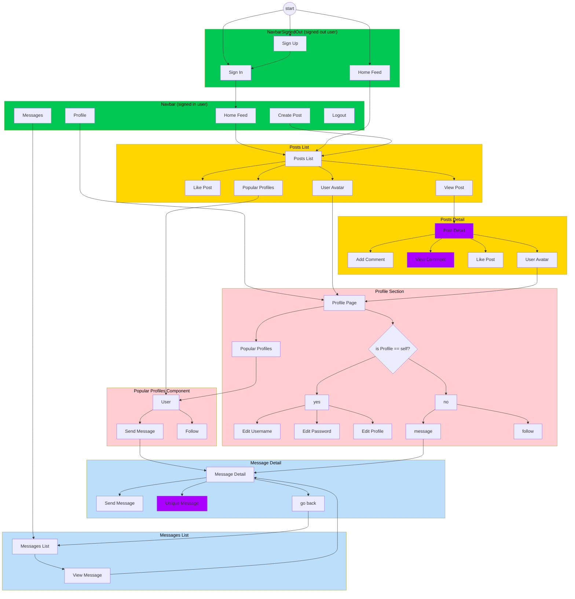

<center>

# **Odyssey** <!-- omit from toc -->

Odyssey is a social media application with a messaging feature.

<!-- GitHub shields for React, CSS, JavaScript, Cloudinary, Django Rest Framework -->

    

***

The documentation is split into two parts: the frontend and the backend.

This Readme Documents the Frontend of the Odyssey Messaging App. 

The Backend is documented in the [Odyssey API Readme]($$$$$$$$$$$).

# **Introduction** <!-- omit from toc -->

$$$$$$$$$

</center>

Sections include:
[1. **Features**](#1-features)
[2. **User Stories**](#2-2-user-stories)
[3. **Automatic Testing**](#3-automatic-testing)
[4. **Installation**](#4-installation)
[5. **Usage**](#5-usage)
[6. **Acknowledgement and Credits**](#6-acknowledgement-and-credits)

# Table of Contents <!-- omit from toc -->
- [1. **Features**](#1-features)
  - [1.1. Messaging](#11-messaging)
  - [1.2. Posts](#12-posts)
  - [1.3. User Authentication](#13-user-authentication)
  - [1.4. Profiles](#14-profiles)
  - [1.5. Follows and Likes](#15-follows-and-likes)
- [2. **User Experience**](#2-user-experience)
  - [User Stories (Strategy and Scope Plane)](#user-stories-strategy-and-scope-plane)
  - [Structure of the Application](#structure-of-the-application)
  - [Skeleton](#skeleton)
    - [Responsive Navbar for Mobile and Desktop](#responsive-navbar-for-mobile-and-desktop)
  - [Surface](#surface)
- [3. **Automatic Testing**](#3-automatic-testing)
- [4. **Installation**](#4-installation)
- [5. Agile Methodology](#5-agile-methodology)
  - [Epics](#epics)
  - [Sprints with User Stories](#sprints-with-user-stories)
- [6. **Acknowledgement and Credits**](#6-acknowledgement-and-credits)
  - [6.1. Moments app as boilerplate](#61-moments-app-as-boilerplate)
  - [6.2. Use of LLMs](#62-use-of-llms)
  - [6.3 Libraries](#63-libraries)
  - [6.4 Personal Acknowledgements](#64-personal-acknowledgements)
- [7. License](#7-license)

---

# 1. **Features**

## 1.1. Messaging

- **Real-Time Messaging**: Engage in instant messaging with individuals or groups.

- **Message List**: View and scroll through a list of your active conversations.

- **Detailed Conversations**: Dive into specific messages within conversations, including media sharing.
- **Message Forms**: Easily send new messages in active conversations or start new conversations with others.

## 1.2. Posts 

- Users can create posts and share them with their followers.
- They can share images and text in their posts.

## 1.3. User Authentication

- Users can sign up and log into the app to access their personalized dashboard.

## 1.4. Profiles

- Users can view detailed profiles of other users, which lists their posts
- Users can customise their own profiles with a profile picture and bio.
- The profile picture appears on posts and in the message section.

## 1.5. Follows and Likes

- Users can follow other users and like their posts.
- 

# 2. **User Experience**

## User Stories (Strategy and Scope Plane)
The user stories are covered in the Agile Methodology.

- **As a user**, I can sign up and log into the app to access my personalized messaging dashboard.
- **As a user**, I can view a list of all my ongoing conversations and quickly access any of them.
- **As a user**, I can start a new conversation with another user by sending the first message.
- **As a user**, I can send and receive messages in real-time within an ongoing conversation.
- **As a user**, I can view detailed information about a conversation, including its history and any attached media.

## Structure of the Application



Website Navigation for signed in user

Purple indicates that the user can EDIT or DELETE the content, providing they are the owner.

Authentication was omitted from the diagram for readability. To summarise:
- The signed out Navbar offers option to SIGN IN or SIGN UP.
- Once signed in, the user can sign out in the navbar.
- A signed out user
  - cannot access messages
  - cannot see options for like or follow
  - cannot create or edit a post

## Skeleton

To make the app, `react-bootstrap` was used for an efficient workflow.

Where possible the app was designed

### Responsive Navbar for Mobile and Desktop

for the Navbar a desktop and mobile component was created to ensure a seamless experience across devices. Then through a hook the Navbar would switch according to screenwidth.

## Surface

Global vars were used to efficently manage the color scheme and typography.


# 3. **Automatic Testing**
- The app includes automatic tests for core components and functionality using testing frameworks like Jest. 
- To run tests, use the following command:
  ```bash
  npm test
  ```
- Tests cover components like message forms, message lists, and detail views to ensure the integrity of the app's messaging functionality.

# 4. **Installation**

It would be advisable to use the [Gitpod IDE](http://gitpod.io) for the installation process, as it is pre-configured with the necessary tools and dependencies, especially around `nvm` and linking to the API.

To get the frontend app up and running locally, follow these steps:

1. **Clone the repository**:
   ```bash
   git clone http://github.com/lmcrean/odyssey_react.git
   ```
2. **Install dependencies**:
   Navigate to the project directory and install the required dependencies:
   ```bash
   npm install
   ```
3. **Install correct node version**:
   Run the following command to start the React app locally:
   ```bash
   nvm install 16
   ```
4. **Run build**:
   Run the following command to build the React app locally:
   ```bash
   npm run build
   ```
5. **Start the development server**:
   Run the following command to start the React app locally:
   ```bash
   npm start
   ```

# 5. Agile Methodology

## Epics

The Epics were designed.

## Sprints with User Stories

THe user stories were distributed across sprints.

# 6. **Acknowledgement and Credits**

## 6.1. Moments app as boilerplate

- "Moments" was used as a boilerplate for the project as it contained the necessary features for a social media platform. Both the API and the React frontend were built from this code.
  - Frontend: https://github.com/Code-Institute-Solutions/moments
  - API:  https://github.com/Code-Institute-Solutions/drf-api
  - Live Demo: 

## 6.2. Use of LLMs

GPT-4o and Claude Sonnet 3.5 were used as an AI tool to generate initial drafts which would be meticulously reviewed.

- writing detailed commit messages
- automatic testing with Python and Jest
- implementation of new features

Commit messages tended to be 95% accurate.

Writing code tended to be anywhere between 50% and 70% accurate, and would require extensive revision with help, gradually moving into fully manual writing.

## 6.3 Libraries

Below is a table listing the key dependencies and devDependencies used in this project, along with brief descriptions and links to more information.

| Dependency & Version                                          | Description                                                                                                                                                          |
|---------------------------------------------------------------|----------------------------------------------------------------------------------------------------------------------------------------------------------------------|
| **@fortawesome/fontawesome-svg-core==^6.6.0**                 | [@fortawesome/fontawesome-svg-core](https://www.npmjs.com/package/@fortawesome/fontawesome-svg-core) is the core package that enables FontAwesome icons in your project. |
| **@fortawesome/free-solid-svg-icons==^6.6.0**                 | [@fortawesome/free-solid-svg-icons](https://www.npmjs.com/package/@fortawesome/free-solid-svg-icons) provides solid style icons from FontAwesome.                     |
| **@fortawesome/react-fontawesome==^0.2.2**                    | [@fortawesome/react-fontawesome](https://www.npmjs.com/package/@fortawesome/react-fontawesome) is a React component library for FontAwesome icons.                    |
| **@testing-library/jest-dom==^5.14.1**                        | [@testing-library/jest-dom](https://www.npmjs.com/package/@testing-library/jest-dom) provides custom jest matchers for DOM node assertions.                           |
| **@testing-library/react==^11.2.7**                           | [@testing-library/react](https://www.npmjs.com/package/@testing-library/react) is a testing utility for React components.                                             |
| **@testing-library/user-event==^12.8.3**                      | [@testing-library/user-event](https://www.npmjs.com/package/@testing-library/user-event) simulates user interactions for testing purposes.                            |
| **axios==^0.21.4**                                            | [axios](https://www.npmjs.com/package/axios) is a promise-based HTTP client for making requests to servers.                                                           |
| **bootstrap==^4.6.0**                                         | [bootstrap](https://www.npmjs.com/package/bootstrap) is a popular front-end framework for building responsive, mobile-first sites.                                    |
| **heroku==^9.1.0**                                            | [heroku](https://www.npmjs.com/package/heroku) is a CLI for interacting with the Heroku platform.                                                                     |
| **jwt-decode==^3.1.2**                                        | [jwt-decode](https://www.npmjs.com/package/jwt-decode) is a small library for decoding JSON Web Tokens (JWT).                                                         |
| **react==^17.0.2**                                            | [react](https://www.npmjs.com/package/react) is a JavaScript library for building user interfaces.                                                                    |
| **react-bootstrap==^1.6.3**                                   | [react-bootstrap](https://www.npmjs.com/package/react-bootstrap) provides Bootstrap components built with React.                                                     |
| **react-dom==^17.0.2**                                        | [react-dom](https://www.npmjs.com/package/react-dom) is the entry point to the DOM and server renderers for React.                                                    |
| **react-infinite-scroll-component==^6.1.0**                   | [react-infinite-scroll-component](https://www.npmjs.com/package/react-infinite-scroll-component) helps implement infinite scrolling in React.                         |
| **react-router-dom==^5.3.0**                                  | [react-router-dom](https://www.npmjs.com/package/react-router-dom) is a library for handling routing in React applications.                                           |
| **react-scripts==4.0.3**                                      | [react-scripts](https://www.npmjs.com/package/react-scripts) provides scripts and configuration used by Create React App.                                             |
| **web-vitals==^1.1.2**                                        | [web-vitals](https://www.npmjs.com/package/web-vitals) is a library for measuring essential web performance metrics.                                                  |
| **@babel/plugin-proposal-private-property-in-object==^7.21.11** | [@babel/plugin-proposal-private-property-in-object](https://www.npmjs.com/package/@babel/plugin-proposal-private-property-in-object) adds support for private properties in objects. This cleared a warning message in the console. |
| **msw==^0.35.0**                                              | [msw](https://www.npmjs.com/package/msw) is a mocking library for intercepting network requests during testing.                                                       |


## 6.4 Personal Acknowledgements

# 7. License

This project is licensed under the MIT License - see the [LICENSE](LICENSE) file for details.